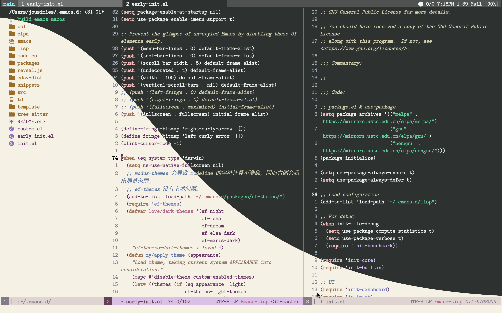
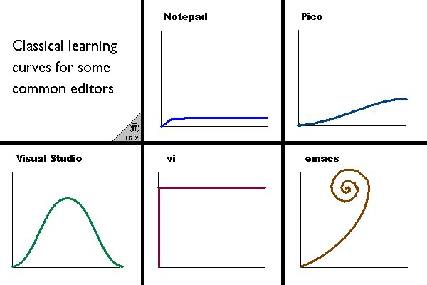

:PROPERTIES:
:ROAM_EXCLUDE: t
:END:
#+TITLE: Jousimies's Personal Emacs Configuration
#+DATE: 2022-05-21
#+AUTHOR: Jousimies
#+OPTIONS: author:nil
#+PROPERTY: header-args:emacs-lisp :results silent :tangle "~/.emacs.d/init.el" :exports code
#+PROPERTY: header-args:shell :tangle "setup.sh"
#+AUTO_TANGLE: t
#+HUGO_BASE_DIR: ~/blog
#+EXPORT_FILE_NAME: Emacs Configuration
#+FILETAGS: Emacs Org-mode
#+HTML_HEAD: <link rel="stylesheet" type="text/css" href="https://gongzhitaao.org/orgcss/org.css"/>
* Introduction
** Interface Show
#+ATTR_ORG: :width 800px
#+ATTR_HTML: :width 1000px

上面的图生成方式如下。如果你打算使用下面的命令，需要对相应的尺寸进行修改。
#+begin_src bash
  magick convert -size 2880x1800 xc:black -fill white -draw "path 'M 0,100 C 1000,200 800,1600 2880,1700 V 1800 H 2880 V 0 H 0'" mask.png
  magick composite dark.png light.png mask.png -alpha Off shot.png
  rm mask.png
#+end_src
** Why Emacs
:PROPERTIES:
:ID:       20220214T145701.300075
:END:
我是怎么知道 Emacs 的？还不是来自编辑器之战，神之编辑器（Emacs）和编辑器之神（VIM）。最先知道的是 VI，因为这个在 Linux 系统中是标配，装上 Linux 系统后怎么都得用到 VI 进行文件配置。寻着一丝丝的线索，VI -> VIM -> sublime -> Atom -> Emacs -> Code . 在这个长长的编辑器上，最终留在了 Emacs 上。至于为什么停留在 Emacs 上，那是因为 Emacs 的强大啊，对于文本的操作强出其他的软件很大一截。

本人前前后后尝试过多种的软件来参与到自己的个人事务管理当中。在遇到 Emacs 之前，在各系统中最喜欢尝鲜，每当遇到一个新的应用，总是会主动去试用。每当试用一个新的软件时，总是认为它会很有用。但是这么长时间以来，高效的软件在多年的使用中留下来的很少，直到我遇到了 Emacs 。现在是个电子的时代，试用的软件多了，对于软件的隐私性保护持保留的态度。虽然现在是网上无个人隐私可言，但是我还是不想把自己的信息随便给别人。Emacs 是一个本地的软件，所有的数据只在本地，数据永远在自己的手中。此外，Emacs 具有强大的生态，可以进行文件管理，财务管理，事务管理，邮件管理，还可以用来听音乐，看视频。

#+NAME: Awesome emacs
#+CAPTION: What Emacs can do
#+ATTR_ORG: :width 500px
#+ATTR_HTML: :width 500px

Emacs 和 Vim 是大浪淘沙留下来的，也是这个时代最强大的编辑器之一。所以为什么不用 Vim 呢？VIM 是一种文本移动方式，它在 Emacs 中也可以实现， Evil。作为模式编辑，还有其他的方式，目前我使用的是 Meow ，它能最大化的保留 Emacs 己有的按键绑定，而不是完全的改变，相对 Evil ，更轻量一些。

Emacs 的学习曲线很特别。现在看这个图，Emacs 会在那转圈圈的原因是因为Emacs 的功能实在是太多了，你总能在不经意的时间发现新的有用的功能。目前使用 M-x 触发后有 8815 条命令，使用 C-h f 触发后的可执行命令有 32058 条，这其中我使用的命令只有一点点。在那转圈圈那不是很正常吗？哈哈哈。这张图应该改改，改成螺旋式上升就更好了。

#+NAME:fig:Emacs learning curve
#+CAPTION:Emacs learning curve
#+ATTR_ORG: :width 500px
#+ATTR_LATEX: :width 10cm :placement [!htpb]
#+ATTR_HTML: :width 600px

** How I manage my packages
我尝试过的 Emacs 配置方式有多种，尝试过的 Emacs 包管理方法有 ~package.el~ ~straight.el~ ~git submodule~ ~borg.el~ 。

最开始使的 Emacs 时，将所有的配置文件放到 ~init.el~ 文件中。后来学习了别人的配置方法，将配置分解到以 ~init-~ 为前缀的多个子文件中。现在我使用 org-mode （见[[https://en.wikipedia.org/wiki/Literate_programming][文学编程]]）组织 Emacs 配置文件。

使用 org-mode 管理自己的配置文件也经历了多个阶段。最开始是直接写在 org 文档中，加载 Emacs 的时候，自动检测该文件的状态，自动解析 org 文档到 el 文件中，这种方式导致 Emacs 启动较慢。后来使用函数在关闭 Emacs 时将 org 文档 tangle 到 el 文件中。现在我使用 org-auto-tangle 这个包，当配置文件发生变动时就自动的 tangle 配置文档。

原来我将 org 文档 tangle 到多个以 ~init-~ 为前缀的子文件中，这样的好处是，可以使用 git 对配置进行更精细化的版本管理。但是在尝试了用了几次后，发现，Emacs 的启动速度慢了很多。

关于包的管理，我使用 git submodule 进行。使用 git submodule 进行包的管理，个人具有最大的可控制性。[[https://github.com/emacscollective/borg][Borg]] 是对 git submodule 的一个包裹，相对完全使用 git submodule 的方式更方便一些。关于此包的详细的使用方法见 [[https://emacsmirror.net/manual/borg/][Borg官方手册]]。

是否需要使用 use-package 类的包？我的回答是不需要。使用 Borg 管理有个好处是， ~borg-assimilate~ 后的包和 Emacs 的内置包一样，不需要使用 use-package 或 leaf 此类包对配置文件进行包裹。在配置中不需要使用 ~require~ 调用某个包，Borg 的方式不会增超 Emacs 的启动时间，我目前有一百六十多个包，启动时间在  +1.6s+ 0.7s 左右（MacOS M1, Emacs 28.1）。

*** How to use my configuration
我不建议直接使用我的这个配置文件，此文件是我自己用的，不能保证你 clone 后能成功跑起来没有问题。我的建议是看看我的配置内容，择你需要的部份，使用你自己的管理方式进行配置。

若你要尝试使用我的配置，进行下面的操作：
#+begin_src bash
  git clone --depth=1 git@github.com:Jousimies/.emacs.d.git
  cd .emacs.d
  make bootstrap-borg
  make bootstrap
#+end_src

执行完上面的操作后，要使用 Emacs 打开  ~README.org~  文件，执行一次  ~org-babel-tangle~  生成  ~init.el~ 。
** About note taking
作为一名非程序员，使用 Emacs 就是奔着 org-mode 来的。Emacs 中能进行任务管理，财务管理，笔记管理都是建立在 org-mode 之上的。Org-mode 在这方面的确很强大。

=笔记的作用= ：存储信息、帮助思考和理解信息、创造知识之间的链接。大脑的优势在于思考，而不是信息的存储。当下最火的笔记管理方式非 Zettelkasten 默属。关于 Zettelkasten 的概念可以看 How to take smart notes 这本书。

我使用过的笔记软件有很多，在遇到 Emacs 前，尝试过的有 PKM 软件， Mediawiki ， Tiddly wiki ， Onenote ，印象笔记，蚂蚁笔记， Simplenote ， Joplin 等等。Onenote 是私有格式，意味着当我需要夸平台时，其专有格式会给我带来麻烦。印象笔记也是如此，而且印象笔记的付费一言难尽。在这些软件中来回尝试了多次之后，发现没有一个能长久使用的，或多或少的存在痛点。

在了解过 markdown ， org-mode 等概念后，结合以上软件的使用体验，我确立了对于笔记管理的要求：​*本地储存，格式可控* 。这个要求 markdown 和 org-mode 都可以满足，这两种语言之上都有着相对应的软件实现， obsidian 和 org-roam 。当然除了 org-roam 之外，还有其他的实现，但是我只使用 org-roam 。

Org-mode 相比 markdown ，特性还是要丰富很多， markdown 相对比较简陋。 org-mode 写完之后可以根据需要将其转化为其他的格式，我需要的如 html，docx，latex 。

Org-mode 是 Emacs 上最强大的笔记应用，如果不是为了进行笔记管理，我很大概率是不使用 Emacs 的（难调较，需要大量的时间，众多的特性中迷失自我）。
** Acknowledgment
#+begin_quote
If I have seen further, it is by standing on the shoulders of giants. ---- Sir Isaac Newton
#+end_quote
谢谢以下配置的作者，从他们那学到了很多关于 Emacs 的知识。排名不分先后。
+ https://github.com/bbatsov/prelude
+ https://github.com/syl20bnr/spacemacs
+ https://github.com/seagle0128/.emacs.d
+ https://github.com/hlissner/doom-emacs
+ https://github.com/remacs/remacs
+ https://github.com/redguardtoo/emacs.d
+ https://github.com/manateelazycat/lazycat-emacs
+ https://github.com/purcell/emacs.d
+ https://github.com/MatthewZMD/.emacs.d
+ https://sachachua.com/dotemacs/
+ https://github.com/raxod502/radian
+ https://tecosaur.github.io/emacs-config/config.html
* The Early Init File
#+begin_src emacs-lisp :tangle early-init.el
  ;;; early-init.el --- Early Init File -*- lexical-binding: t; no-byte-compile: t -*-
  ;; Defer garbage collection further back in the startup process
  (setq gc-cons-threshold most-positive-fixnum
        gc-cons-percentage 0.6)
  ;; In Emacs 27+, package initialization occurs before `user-init-file' is
  ;; loaded, but after `early-init-file'. Doom handles package initialization, so
  ;; we must prevent Emacs from doing it early!
  (setq package-enable-at-startup nil)
  ;; Do not allow loading from the package cache (same reason).
  (setq package-quickstart nil)
  ;; Prevent the glimpse of un-styled Emacs by disabling these UI elements early.
  (setq inhibit-startup-message t)
  (setq inhibit-splash-screen t)
  (push '(menu-bar-lines . 0) default-frame-alist)
  (push '(tool-bar-lines . 0) default-frame-alist)
  (push '(vertical-scroll-bars) default-frame-alist)
  (push '(fullscreen . maximized) default-frame-alist)
  ;; Resizing the Emacs frame can be a terribly expensive part of changing the
  ;; font. By inhibiting this, we easily halve startup times with fonts that are
  ;; larger than the system default.
  (setq frame-inhibit-implied-resize t)
  (setq inhibit-compacting-font-caches t)
  (setq use-file-dialog nil)
  (setq use-dialog-box nil)
  ;; Make the initial buffer load faster by setting its mode to fundamental-mode
  ;; (setq initial-major-mode 'fundamental-mode)
  ;; Prevent unwanted runtime builds in gccemacs (native-comp); packages are
  ;; compiled ahead-of-time when they are installed and site files are compiled
  ;; when gccemacs is installed.
  (setq comp-deferred-compilation nil)
  ;; Disable mode-line, It's uglily after theme changed
  (setq-default mode-line-format nil)
  ;;; early-init.el ends here
#+end_src
* Emacs Foundation Configuration
#+begin_quote
其安易持，其未兆易谋；其脆易泮，其微易散。为之于未有，治之于未乱。合抱之木，生于毫末；九层之台，起于累土；千里之行，始于足下。 -- 老子
#+end_quote
这部分是 Emacs 的最基础配置，包含了文件的管理方式，Emacs 的快速启动，自定义的变量，以及 custom 文件。这些配置是其他配置的基石。

关于 lexical-binding 的作用见 [[https://nullprogram.com/blog/2016/12/22/][Make Emacs run (slightly) faster with lexical binding]] . 或者 [[http://www.yinwang.org/blog-cn/2013/03/26/lisp-dead-alive][Lisp 已死，Lisp 万岁！]]
#+begin_src emacs-lisp
  ;; init.el --- Personal Emacs Configuration -*- lexical-binding: t; -*-
#+end_src

#+begin_src emacs-lisp
  (defvar my/init-start-time (current-time) "Time when init.el was started.")
  (defvar my/section-start-time (current-time) "Time when section was started.")

  (global-set-key (kbd "C-c f o I") (lambda () (interactive) (find-file (expand-file-name "README.org" user-emacs-directory))))
#+end_src
** DEBUG
当需要对 Emacs 的配置进行错误检测时打开，但是基本不需要在配置中写这部分。没启动的时候可以使用 ~--debug-init~ ，启动后可以手动开启 debug 。正常使用 Emacs 时也会触发一些错误，这时候弹出 error 窗口就很烦。
#+begin_src emacs-lisp :tangle no
  (toggle-debug-on-error)
#+end_src
** Profile
#+begin_src emacs-lisp :tangle no
  (profiler-start 'cpu)
#+end_src
** Borg - Package manage
#+begin_quote
The Borg assimilate Emacs packages as Git submodules.
#+end_quote
一般的流程是使用 ~epkg-describe-package~ 查看包的依赖，然后直接使用 ~borg-assimilate~ 命令安装包。或者先使用 ~borg-clone~ 命令克隆包到本地，然后使用 ~borg-build~ 对包进行编译安装。

但是我一般直接使用 ~borg assimilate~ 命令安装某个包，之后跟据 ~*Borg Build*~ buffer 的提示安装相应依赖包。重复上述的步骤，即可。
如果一个包并不在 melpa 上，就需要到 github 上获取链接。

重新 build 一个包之前可以对 .gitmodules 进行编辑，下面给出示例：
#+begin_example
[submodule "magit"]
	path = packages/magit
	url = git@github.com:magit/magit.git
	no-byte-compile = lisp/magit-libgit.el
	recursive-byte-compile = true
#+end_example
#+begin_example
[submodule "auctex"]
	path = packages/auctex
	url = git@github.com:emacsmirror/auctex.git
	build-step = ./autogen.sh
	build-step = ./configure --with-texmf-dir=$HOME/texmf
	build-step = make
	build-step = sudo make install
#+end_example
#+begin_example
[submodule "corfu"]
	path = packages/corfu
	url = git@github.com:minad/corfu.git
	load-path = .
	load-path = ./extensions
#+end_example
简单说明：如果不想 compile 一个包就使用 no-byte-compile 选项。比如，我不使用 helm 插件，有些包提供了关于 helm 的支持，此时我就可以不 compile 对应的文件，那么 Emacs 就不会加载这些配置。对于有些包需要安装的就使用 build-step 进行。对于有些包在子文件夹中的使用 load-path 加载。

Borg 升级包，可以在 magit 界面中进行，按 ~f m~ 获取 submodule 的更新，展开 ~Modules~ 可以看到 ~Modules unpulled~ ，进入相应的包中的 magit 界面，通过按 ~SPC k~ 删除 ~Untracked files~ ，然后按 ~m~ merge 配置。最后使用 ~borg-build~ 重新 build 包即可升级相应的包。有时候会提示某个文件有旧的版本，那么就需要进行这个包的文件夹，把 ~.elc~ 文件删除然后再重新 build 。
#+begin_src emacs-lisp
  (eval-and-compile
    (add-to-list 'load-path (expand-file-name "packages/borg" user-emacs-directory))
    (require 'borg)
    (borg-initialize))
#+end_src
** Startup
*** Start Speedup
该配置来自 [[https://github.com/seagle0128/.emacs.d/blob/master/init.el][Centaur Emacs]] ，可以有效减少 Emacs 的启动时间，约 0.5s 。
#+begin_src emacs-lisp
  (setq auto-mode-case-fold nil)

  (unless (or (daemonp) noninteractive init-file-debug)
    (let ((old-file-name-handler-alist file-name-handler-alist))
      (setq file-name-handler-alist nil)
      (add-hook 'emacs-startup-hook
                (lambda ()
                  "Recover file name handlers."
                  (setq file-name-handler-alist
                        (delete-dups (append file-name-handler-alist
                                             old-file-name-handler-alist)))))))
#+end_src
*** Fullscreen
MacOS 上全屏使用 Emacs 有点问题。如果你要使用 ~eaf~ ，就不要全屏使用 Emacs 。说明见此：[[https://github.com/manateelazycat?tab=repositories][Andy Stewart]] 。
#+begin_example
  (if (featurep 'cocoa)
      (progn
        (setq ns-use-native-fullscreen nil)
        (setq ns-use-fullscreen-animation nil)))
  (set-frame-parameter (selected-frame) 'fullscreen 'maximized)
  (run-at-time 1 nil
               (lambda ()
                 (toggle-frame-fullscreen)))
#+end_example
#+begin_src emacs-lisp
  (toggle-frame-fullscreen)
#+end_src
*** Utility hooks and functions
#+begin_quote
This package exposes a number of utility hooks and functions ported from Doom Emacs. The hooks make it easier to speed up Emacs startup by providing finer-grained control of the timing at which packages are loaded.
#+end_quote
按照这个包的说明，是用于更精细化的管理包的加载，以便加快 Emacs 的启动速度。

目前对于其的作用理解不是很深，如果需要深入理解需要对 Emacs 的启动步骤进行研究。

目前使用 ~after-init-hook~ 也行。此包提供的几个 hook 也能用， ~on-first-file-hook~ 用于当打开第一个文件的时候执行对应用的任务， ~on-first-input-hook~ 用于按键被触发后执行对应的任务， ~on-first-buffer-hook~ 用于第一个 buffer 被创建时执行对应的任务。
#+begin_src emacs-lisp
  (require 'on)
#+end_src
** Variables
自定义一些变量，方便配置文件位置或针对特定系统进行相关设定。
#+begin_src emacs-lisp
  (defvar my-cloud "~/Nextcloud"
    "This folder is My cloud.")
  (defvar my-galaxy (expand-file-name "L.Personal.Galaxy" my-cloud)
    "This folder stores all the plain text files of my life.")
  (defvar my-roam (expand-file-name "roam" my-galaxy)
    "This is the org-roam folder.")
  (defvar my-finance (expand-file-name "finance" my-galaxy)
    "This folder stores all my finance files.")
  (defvar my-finance-year (expand-file-name (format-time-string "%Y") my-finance)
    "This folder stores all my finance files of current year.")
  (defvar my-pdf-storage (expand-file-name "storage/pdf" my-galaxy)
    "This folder stores all the pdf files.")
#+end_src

#+begin_src emacs-lisp
  (require 'no-littering)
#+end_src
** Custom file
Emacs 有时会将一些配置自动导入到此文件中。如果不配置，它会自动将配置附加到 ~init.el~ 文件中。我不喜欢这个文件，当其出现的时候，我会手动删除。也许可以写个 function 自动执行。
#+begin_src emacs-lisp
  (setq custom-file (expand-file-name "custom.el" user-emacs-directory))
  (load custom-file t)
#+end_src
** Private file
私有配置分开存放，不进行同步。
#+begin_src emacs-lisp
  (defvar private-file nil "My private Emacs configuration.")
  (setq private-file (expand-file-name "private.el" user-emacs-directory))
  (load private-file t)
#+end_src
** Homebrew
#+begin_src shell :tangle (if (featurep 'cocoa) "setup.sh" no) :tangle-mode (identity #o755)
  brew_install() {
      echo "\nInstalling $1"
      if brew list $1 &>/dev/null; then
          echo "${1} is already installed"
      else
          brew install $1 && echo "$1 is installed"
      fi
  }
#+end_src
** Benchmark
Emacs Foundation Configuration 启动时间约 0.19s 。
#+begin_src emacs-lisp
  (message "Emacs Foundation Configuration: %.2fs"
           (float-time (time-subtract (current-time) my/section-start-time)))
#+end_src
* Emacs User interface, DELICIOUS
Emacs 中视觉相关的配置基本都在这里了，目前我喜欢极简的界面。
#+begin_src emacs-lisp
  (setq my/section-start-time (current-time))
#+end_src
** Fonts
对于字体的选择有 Iosevka Fixed，Fantasque Sans Mono，Sarasa Mono SC，HarmonyOS Sans SC，Source Han Serif SC。

设置字体的两种方式：一种是通过 ~set-fontset-font~ 设置中文字体，另外一种是设置 fixed-pitch 和 variable-pitch 字体，开启 ~variable-pitch-mode~ 。

另外结合 [[modus-themes]] ，通过设置 modus-themes-mixed-pitch 可以在 org-table org-block 等环境中使用固定宽度的字体。

尝试使用了几天后，发现开启 variable-pitch-mode 之后，光标的宽度变的很细，看起来很不舒服。

自从把 all-the-icons 这个去掉之后，不用担心字体被替代的问题。把 cursor 设置成 bar 的模式， variable-pitch-mode 看起来也蛮舒服的。
#+begin_src shell :tangle (if (executable-find "brew") "setup.sh" no)
  brew_install "homebrew/cask-fonts/font-iosevka"
#+end_src
#+begin_src emacs-lisp
  (set-face-attribute 'default nil :family "Iosevka Fixed" :weight 'regular :height 160)
  (set-face-attribute 'fixed-pitch nil :family "Iosevka Fixed" :weight 'regular :height 180)
  (set-face-attribute 'variable-pitch nil :family "Source Han Serif SC" :weight 'regular :height 160)
  (setq modus-themes-mixed-fonts t)
  (variable-pitch-mode)
#+end_src
#+begin_src emacs-lisp :tangle no
  (set-face-attribute 'default nil :family "Iosevka Fixed" :weight 'regular :height 160)
  (set-fontset-font t 'han (font-spec :name "Source Han Serif SC" :weight 'regular :height 160))
  (set-fontset-font t 'cjk-misc (font-spec :name "Source Han Serif SC" :weight 'regular :height 160))
#+end_src
** modus-themes
我的默认主题是 modus-themes ，有黑白配色两套。这个包的自定义性特别高，详细的设置见[[https://protesilaos.com/emacs/modus-themes][官方手册]]。

Modus-themes 的暗色模式实在是太黑了，长时间看很不舒服。椐据 MacOS 的系统颜色，替换了背景色。
#+begin_src emacs-lisp
  (setq modus-themes-italic-constructs t)
  (setq modus-themes-bold-constructs nil)
  (setq modus-themes-region '(accented))
  (setq modus-themes-lang-checkers '(straight-underline text-also intense))
  (setq modus-themes-links '(neutral-underline))
  (setq modus-themes-hl-line '(intense))
  (setq modus-themes-paren-match '(accented intense))
  (setq modus-themes-prompts '(intense background gray bold))
  (setq modus-themes-completions '((matches . (extrabold intense))
                                   (selection . (underline))
                                   (popup . (intense))))
  (setq modus-themes-org-blocks 'tinted-background)
  (setq modus-themes-org-agenda '((header-block . (variable-pitch 1.2))
                                  (habit . traffic-light)))
  (setq modus-themes-headings '((t . (rainbow))))
#+end_src

Modus-theme 的主题色有些我还是不喜欢，根据自己的喜好更改了一些颜色设置。其中 ~bg-main~ ~bg-dim~ 控制背景色。  ~magenta-nuanced-bg~  控制  ~org-src block~  的背景色。
#+begin_src emacs-lisp
  (setq modus-themes-operandi-color-overrides '((bg-main . "#FFFFFF")
                                                (bg-dim . "#FFFFFF")
                                                (bg-hl-line . "#FFFFFF")
                                                (bg-active . "#FFFFFF")
                                                (bg-inactive . "#FFFFFF")
                                                (bg-tab-bar . "#FFFFFF")
                                                (bg-tab-active . "#FFFFFF")
                                                (bg-tab-inactive . "#FFFFFF")
                                                (blue . "#252321")
                                                (magenta-nuanced-bg . "#F2F0EF")))
  (setq modus-themes-vivendi-color-overrides '((bg-main . "#1F1F1E")
                                               (bg-dim . "#1F1F1E")
                                               (bg-hl-line . "#1F1F1E")
                                               (bg-active . "#1F1F1E")
                                               (bg-inactive . "#1F1F1E")
                                               (bg-tab-bar . "#1F1F1E")
                                               (bg-tab-active . "#1F1F1E")
                                               (bg-tab-inactive . "#1F1F1E")
                                               (blue . "#FFFFFF")
                                               (magenta-nuanced-bg . "#343435")))
#+end_src
** Theme auto change
目前切换到了 MacOS 上使用 Emacs ，[[https://github.com/d12frosted/homebrew-emacs-plus][Emacs-plus]] 可根据系统主题自动切换 Emacs 主题。
#+begin_src emacs-lisp :tangle (if (eq system-type 'darwin) "~/.emacs.d/init.el" "no")
  (defun my/apply-theme (appearance)
    "Load theme, taking current system APPEARANCE into consideration."
    (mapc #'disable-theme custom-enabled-themes)
    (pcase appearance
      ('light (load-theme 'modus-operandi t))
      ('dark (load-theme 'modus-vivendi t))))
  (add-hook 'ns-system-appearance-change-functions #'my/apply-theme)
#+end_src
** tab-bar
#+begin_src emacs-lisp
  (setq tab-bar-format '(tab-bar-format-history
                         tab-bar-format-tabs
                         tab-bar-separator
                         tab-bar-format-align-right
                         tab-bar-format-global))
  (setq tab-bar-close-button-show nil)
  (setq tab-bar-tab-hints t)

  ;; (add-to-list 'global-mode-string '(:eval mode-line-position))
  ;; (add-to-list 'global-mode-string '(:eval mode-line-front-space))
  ;; (add-to-list 'global-mode-string '(:eval mode-line-modified))
  ;; (add-to-list 'global-mode-string '(:eval mode-line-mule-info))

  (tab-bar-mode t)
#+end_src
** awesome-tray
#+begin_src emacs-lisp
  (add-hook 'after-init-hook 'awesome-tray-mode)
  (setq awesome-tray-active-modules '("location" "pdf-view-page" "mode-name"))
#+end_src
** window-divider
使用 ~face-spec-sat~ 重置 ~window-divider~ 的颜色。同样的方式可以重置其他的使用 defface 定义的颜色。
#+begin_src emacs-lisp
  (setq window-divider-default-bottom-width 1)
  (setq window-divider-default-right-width 1)
  (setq window-divider-default-places t)
  (face-spec-set 'window-divider
           '((((background light))
              :foreground "#000000")
             (t
              :foreground "#FFFFFF"))
           'face-override-spec)
  (add-hook 'after-init-hook 'window-divider-mode)
#+end_src

** cursor
因为我不使用 modeline 当有多个 buffer 的时候会不知道当前处于哪个 buffer 中，所以关闭其他窗口中的光标，这样哪个 buffer 中有光标，哪个 buffer 就处于活动状态。
#+begin_src emacs-lisp
  (blink-cursor-mode -1)
  (setq-default cursor-type 'bar)
  (setq-default cursor-in-non-selected-windows nil)
#+end_src

我 Fork 了 [[https://github.com/Jousimies/im-cursor-chg][im-cursor-chg]] 这个包，对其做了一些修改，以实现主题切换时能自动切换光标颜色。
#+begin_src emacs-lisp
  (add-hook 'text-mode-hook 'cursor-chg-mode)
#+end_src
** Fringe bitmap
Word wrap at window edge, hide the right and left curly arrow. So ugly.
#+begin_src emacs-lisp
  (define-fringe-bitmap 'right-curly-arrow  [])
  (define-fringe-bitmap 'left-curly-arrow  [])
#+end_src
** Highlight line
#+begin_src emacs-lisp
  (add-hook 'on-first-buffer-hook 'global-hl-line-mode)
  (add-hook 'eshell-mode-hook (lambda () (setq-local global-hl-line-mode nil)))
#+end_src
** info-colors
#+begin_src emacs-lisp
  (add-hook 'Info-selection-hook 'info-colors-fontify-node)
#+end_src
** rainbow-mode
#+begin_src emacs-lisp
  (add-hook 'prog-mode-hook 'rainbow-mode)
#+end_src
** goggles
#+begin_quote
Goggles highlights the modified region using pulse. Currently the commands undo, yank, kill and delete are supported.
#+end_quote
#+begin_src emacs-lisp
  (setq-default goggles-pulse t)
  (add-hook 'prog-mode-hook 'goggles-mode)
  (add-hook 'text-mode-hook 'goggles-mode)
#+end_src
** Emacs window management
Emacs 中的窗口管理。有一些包如 popup ， shackle 等可以使用，但是我选择使用 display-buffer-alist 进行窗口的管理。Emacs 中的窗口总是感觉乱乱的。
*** switch-to-buffer
#+begin_src emacs-lisp
  (global-set-key (kbd "C-c w m") (lambda () (interactive) (switch-to-buffer "*Messages*")))
  (global-set-key (kbd "C-c w s") (lambda () (interactive) (switch-to-buffer "*scratch*")))
#+end_src
*** last-buffer
#+begin_src emacs-lisp
  (defun meow-last-buffer (arg)
    "Switch to last buffer.
  Argument ARG if not nil, switching in a new window."
    (interactive "P")
    (cond
     ((minibufferp)
      (keyboard-escape-quit))
     ((not arg)
      (mode-line-other-buffer))
     (t)))

  (global-set-key (kbd "<escape>") 'meow-last-buffer)
#+end_src
*** Quit and delete window
删除窗口，而不是只是隐藏它，见 [[https://www.reddit.com/r/emacs/comments/t1rvbd/help_wanted_emacs_doesnt_really_deletes_special/][Reddit]] 。这个对于一些临时 buffer 很有用，使用 ESC 进行最近 buffer 切换时，就不会出现不想要的 buffer。
#+begin_src emacs-lisp
  (defun quit-window-delete (&optional kill window)
    "Quit WINDOW, deleting it, and bury its buffer.
  WINDOW must be a live window and defaults to the selected one.
  With prefix argument KILL non-nil, kill the buffer instead of
  burying it.
  This is similar to the version of `quit-window' that Emacs had before
  the introduction of `quit-restore-window'.  It ignores the information
  stored in WINDOW's `quit-restore' window parameter.
  It deletes the WINDOW more often, rather than switching to another
  buffer in it.  If WINDOW is alone in its frame then the frame is
  deleted or iconified, according to option `frame-auto-hide-function'."
    (interactive "P")
    (set-window-parameter window 'quit-restore `(frame frame nil ,(current-buffer)))
    (quit-restore-window window (if kill 'kill 'bury)))
  (global-set-key [remap quit-window] 'quit-window-delete)
#+end_src
*** Scroll other window
这个在并排使用两个 buffer 的时候很好用，通过 ~M-n~ 和 ~M-p~ 移动另一个 buffer 中的内容。
#+begin_src emacs-lisp
  (defun my/scroll-other-windown-down ()
    "Scroll other window down."
    (interactive)
    (scroll-other-window-down 2))
  (defun my/scroll-other-windown ()
    "Scroll other window up."
    (interactive)
    (scroll-other-window 2))
  (global-set-key (kbd "M-n") 'my/scroll-other-windown)
  (global-set-key (kbd "M-p") 'my/scroll-other-windown-down)
#+end_src
** Benchmark
Emacs User interface 启动时间约 0.05s 。
#+begin_src emacs-lisp
  (message "Emacs User interface: %.2fs"
	   (float-time (time-subtract (current-time) my/section-start-time)))
#+end_src
* Powerful Emacs Equipped with Builtin Packages
Emacs 本身就是一个宝库，有很多的内置功能 ，这些功能的实现简单而强大，名符其实的操作系统。这部份的详细介绍，可以参见 [[https://github.com/condy0919/emacs-newbie/blob/master/introduction-to-builtin-modes.md][Emacs builtin modes 功能介绍]]。
#+begin_src emacs-lisp
  (setq my/section-start-time (current-time))
#+end_src
** Basic
#+begin_src emacs-lisp
  (setq read-process-output-max #x10000)
#+end_src

使用 y 替代 yes，使用 n 替代 no, 可以少输几个字符。Emacs 28.1 内置了 use-short-answers 变量，就很方便了，不再需要使用 advice 的方式设置此功能。
#+begin_src emacs-lisp
  (setq use-short-answers t)
#+end_src

没有人不关这个吧？吵死了。
#+begin_src emacs-lisp
  (setq ring-bell-function 'ignore)
#+end_src

#+begin_src emacs-lisp
  (setq-default indent-tabs-mode nil)
  (setq-default tab-width 4)
#+end_src
** system coding
#+begin_src emacs-lisp
  (when (fboundp 'set-charset-priority)
    (set-charset-priority 'unicode))

  (prefer-coding-system 'utf-8)
  (set-default-coding-systems 'utf-8)
  (set-terminal-coding-system 'utf-8)
  (set-keyboard-coding-system 'utf-8)
#+end_src
** message
#+begin_src emacs-lisp
  (setq message-kill-buffer-on-exit t)
  (setq message-sendmail-envelope-from 'header)
  (setq message-kill-buffer-query nil)
  (setq message-sendmail-extra-arguments '("-a" "outlook"))
  (setq message-send-mail-function 'sendmail-send-it)
#+end_src
** send mail
#+begin_src emacs-lisp
  (setq send-mail-function 'sendmail-send-it)
  (setq sendmail-program (executable-find "msmtp"))
  (setq mail-specify-envelope-from t)
  (setq mail-envelope-from 'header)
#+end_src
** help
#+begin_src emacs-lisp
  (setq help-window-select t)
#+end_src
** menu-bar
*** buffer
#+begin_src emacs-lisp
  (global-set-key (kbd "C-c w d") 'kill-this-buffer)
#+end_src
*** word wrap
我喜欢文本在窗口的边缘进行折行。不喜欢使用 visual-line-mode 式的折行，此方式当中英文夹杂时，在行尾参差不齐，实在是用不来。
#+begin_src emacs-lisp
  (add-hook 'org-mode-hook 'menu-bar--wrap-long-lines-window-edge)
#+end_src
** midnight
#+begin_src emacs-lisp
  (add-hook 'on-first-buffer-hook 'midnight-mode)
#+end_src
** time
#+begin_src emacs-lisp
  (setq display-time-24hr-format t)
  (setq display-time-format "%m/%d %H:%M %a")
  (setq display-time-load-average-threshold nil)
  (defface my/date-face
    '((((background light))
       :foreground "darkred" :bold t)
      (t
       :foreground "deep sky blue" :bold t))
    "Date face."
    :group 'display-time)
  (setq display-time-string-forms
        '((propertize (format-time-string "%m/%d %H:%M %a" now) 'face 'my/date-face)))
  (add-hook 'after-init-hook 'display-time-mode 20)
#+end_src
** images
#+begin_src emacs-lisp
  (add-to-list 'image-type-file-name-regexps '("\\.eps\\'" . imagemagick)  )
  (add-to-list 'image-file-name-extensions "eps")
  (imagemagick-register-types)
#+end_src
** battery
#+begin_src emacs-lisp
  (setq battery-load-critical 15)
  (setq battery-mode-line-format " %b%p% ")
  (add-hook 'after-init-hook 'display-battery-mode 10)
#+end_src
** whitespace
#+begin_src emacs-lisp
  (setq whitespace-style '(face trailing))
  (add-hook 'prog-mode-hook 'whitespace-mode)
  (add-hook 'org-mode-hook 'whitespace-mode)
#+end_src
** kill-ring
Do not saves duplicates in kill-ring
#+begin_src emacs-lisp
  (setq kill-do-not-save-duplicates t)
#+end_src
** eldoc
在 echo 中显示有关函数或变量的信息。
#+begin_src emacs-lisp
  (add-hook 'on-first-buffer-hook 'eldoc-mode)
#+end_src
** authinfo
Emacs 中可以使用 .authinfo.gpg 存储密码，需要使用到的有 epa 、 epg 包。在使用 .authinfo.gpg 保存密码之前，应该使用 gpg 生成密钥。这里有个[[https://www.masteringemacs.org/article/keeping-secrets-in-emacs-gnupg-auth-sources][教程]]写的比较详细。
#+begin_src bash
  gpg --gen-key
  gpg --list-secret-keys
#+end_src
新建 .authinfo.gpg 文件之后，保存该文件，就会提示你进行下一步加密设置。下次打开该文件会提示你输入密码，否则不能查看该文件的内容。使用其他的软件打开这个文件也会显示乱码。
#+begin_src emacs-lisp
  (with-eval-after-load 'epa-file
    (epa-file-enable)
    (setq epg-pinentry-mode 'loopback)
    (auth-source-forget-all-cached))
#+end_src
** paren
#+begin_src emacs-lisp
  (setq show-paren-style 'mixed
        show-paren-when-point-inside-paren t
        show-paren-when-point-in-periphery t)
  (add-hook 'text-mode-hook 'show-paren-mode)
#+end_src
** elec-pair
在 org-mode 中有些人喜欢使用 < 快速插入 src block ，但是 elec-pair 会插入成对的 <> ，所以可以在 org-mode 中禁用这个功能，如何设置参见 [[https://github.com/SystemCrafters/rational-emacs/blob/master/modules/rational-org.el][rational-emacs]] 。

我不需要这个功能，因为我还是喜欢使用 ~C-c C-,~ 插入相应的块。
#+begin_src emacs-lisp
  (electric-pair-mode)
#+end_src
** line number
在 prog-mode 中显示行号，当在 org-mode 中，不显示行号。
#+begin_src emacs-lisp
  (setq display-line-numbers t)
  (add-hook 'prog-mode-hook 'display-line-numbers-mode)
#+end_src
** simple
#+begin_src emacs-lisp
  (setq mail-user-agent 'mu4e-user-agent)
#+end_src
** autorevert
#+begin_src emacs-lisp
  (setq auto-revert-verbose t)
  (add-hook 'on-first-file-hook 'global-auto-revert-mode)
#+end_src
** subword
Enabling it remaps word-based editing commands to subword-based commands that handle symbols with mixed uppercase and lowercase letters。
#+begin_src emacs-lisp
  (add-hook 'on-first-input-hook 'global-subword-mode)
#+end_src
** windmove
#+begin_src emacs-lisp
  (global-set-key (kbd "C-c w b") 'windmove-left)
  (global-set-key (kbd "C-c w n") 'windmove-down)
  (global-set-key (kbd "C-c w p") 'windmove-up)
  (global-set-key (kbd "C-c w f") 'windmove-right)
#+end_src
** winner
#+begin_src emacs-lisp
  (setq winner-dont-bind-my-keys nil)
  (add-hook 'on-first-buffer-hook 'winner-mode)
#+end_src
** server
According to this [[https://emacshorrors.com/posts/determining-if-the-server-is-started-or-the-wonders-of-server-running-p.html][blog]], use ~server-process~ instead of ~server-ruanning-p~ 。但是当我新开一个 Emacs 时，会报错，所以还是回到原来的配置上。
#+begin_src emacs-lisp
  (add-hook 'after-init-hook 'server-mode)
#+end_src
** prettify-symbols-mode
这个 mode 可以替换一些 fancy 的字体，但是目前没找到好看的字体。
#+begin_src emacs-lisp
  (setq prettify-symbols-alist '(("lambda" . ?λ)
				 ("function" . ?𝑓)))
  (add-hook 'prog-mode-hook 'prettify-symbols-mode)
#+end_src
** so-long
Emacs 的长行检测。在 Emacs 中当编辑长行时，会很卡，开启此模式可以提高性能。
#+begin_src emacs-lisp
  (add-hook 'text-mode-hook 'global-so-long-mode)
#+end_src
** delsel
插入文本会将所选文本删除，这在其他的很多软件中都有，Emacs 中默认没有，需要手动开启。
#+begin_src emacs-lisp
  (add-hook 'on-first-input-hook 'delete-selection-mode)
#+end_src
** repeat
重复某个按键，比如在调整窗口大小时。
#+begin_src emacs-lisp
  (setq repeat-on-final-keystroke t)
  (setq set-mark-command-repeat-pop t)
  (add-hook 'after-init-hook 'repeat-mode)
#+end_src
*** resize-window-repeat-map
结合 ~repeat-mode~ 可以很方便的控制窗口的大小。通过 ~C-x~ 触发。此设置来自 [[https://github.com/protesilaos/dotfiles/blob/master/emacs/.emacs.d/prot-emacs.org][protesilaos]] 大神。
#+begin_src emacs-lisp
  (defvar resize-window-repeat-map
    (let ((map (make-sparse-keymap)))
      (define-key map "^" 'enlarge-window)
      (define-key map "}" 'enlarge-window-horizontally)
      (define-key map "{" 'shrink-window-horizontally)
      (define-key map "v" 'shrink-window)
      map)
    "Keymap to repeat window resizing commands.  Used in `repeat-mode'.")
  (put 'enlarge-window 'repeat-map 'resize-window-repeat-map)
  (put 'enlarge-window-horizontally 'repeat-map 'resize-window-repeat-map)
  (put 'shrink-window-horizontally 'repeat-map 'resize-window-repeat-map)
  (put 'shrink-window 'repeat-map 'resize-window-repeat-map)
#+end_src
** minibuffer
#+begin_src emacs-lisp
  (setq minibuffer-prompt-properties
        '(read-only t cursor-intangible t face minibuffer-prompt))
#+end_src
** ibuffer
#+begin_src emacs-lisp
  (setq ibuffer-formats '((mark modified read-only locked " "
                                (name 40 40 :left :elide) " "
                                (size 9 -1 :right) " "
                                (mode 16 16 :left :elide) " "
                                filename-and-process)
                          (mark " " (name 30 -1) " " filename)))
  (setq ibuffer-saved-filter-groups
        (quote (("DEFAULT"
                 ("DIRED" (mode . dired-mode))
                 ("ORG" (mode . org-mode))
                 ("PDF" (name . "\\.pdf"))
                 ("planner" (or
                             (name . "^\\*Calendar\\*$")
                             (name . "^diary$")
                             (mode . muse-mode)))
                 ("EMACS" (or
                           (name . "^\\*scratch\\*$")
                           (name . "^\\*Messages\\*$")))))))
  (add-hook 'ibuffer-mode-hook
              (lambda ()
                (ibuffer-switch-to-saved-filter-groups "DEFAULT")))
  (global-set-key (kbd "C-x C-b") 'ibuffer-jump)
#+end_src
** mouse-avoidance
Builtin function. Hide mouse when type.
#+begin_src emacs-lisp :tangle no
  (mouse-avoidance-mode 'banish)
#+end_src
** cursor-intangible
#+begin_src emacs-lisp
  (add-hook 'minibuffer-setup-hook #'cursor-intangible-mode)
#+end_src
** large file
#+begin_src emacs-lisp
  (setq large-file-warning-threshold nil)
#+end_src
** Hippie
妙啊，Hippie-expand 的功能是这么的好用，我原来输入路径需要使用 cape-file，现在使用 hippie-expand 就好了。它还有其他的功能，介绍性的说明可以[[https://www.masteringemacs.org/article/text-expansion-hippie-expand][看这]]。

设置 ~hippie-expand-try-functions-list~ ，把 ~try-expand-list~ 和 ~try-expand-line~ 去掉，他们会在末尾增加括号，有点多余。我己经使用 [[elec-pair]] 自动成对插入括号。
#+begin_src emacs-lisp
  (setq hippie-expand-try-functions-list '(try-complete-file-name-partially
                                           try-complete-file-name
                                           try-expand-all-abbrevs
                                           try-expand-dabbrev
                                           try-expand-dabbrev-all-buffers
                                           try-expand-dabbrev-from-kill
                                           try-complete-lisp-symbol-partially
                                           try-complete-lisp-symbol))

  (global-set-key [remap dabbrev-expand] 'hippie-expand)
#+end_src
** Benchmark
Powerful Emacs Equipped with Builtin Packages 启动时间约 0.04s 。
#+begin_src emacs-lisp
  (message "Powerful Emacs Equipped with Builtin Packages: %.2fs"
	   (float-time (time-subtract (current-time) my/section-start-time)))
#+end_src
* Awesome Emacs Equipped with Third-party Packages
编辑器的基本功能就是增删改查。
#+begin_src emacs-lisp
  (setq my/section-start-time (current-time))
#+end_src
** helpful
#+begin_src emacs-lisp
  (global-set-key [remap describe-function] 'helpful-callable)
  (global-set-key [remap describe-variable] 'helpful-variable)
  (global-set-key [remap describe-key] 'helpful-key)
#+end_src
** gcmh
Emacs 中拉圾回收的策略是当Emacs自上一次垃圾收集后分配的内存超过 ~gc-cons-threshold~ 阀值时就会触发新一轮的垃圾收集行为。~gcmh~ 包对 Emacs 的拉圾回收进行了设置，当正常使用时，拉圾回收的阈值设置的较高，当 Emacs 空闲时阈值设的较低。

[[http://blog.lujun9972.win/blog/2019/05/16/优化emacs的垃圾搜集行为/index.html][优化Emacs的垃圾搜集行为]] 一文中提出了通过记录每次垃圾收集的时间来进行判断和调整 ~gc-cons-threshold~ 的值。
#+begin_src emacs-lisp
  (setq gcmh-idle-delay 'auto)
  (setq gcmh-auto-idle-delay-factor 10)
  (setq gcmh-high-cons-threshold #x1000000)
  (gcmh-mode 1)
#+end_src
** input method
*** ace-pinyin
#+begin_src emacs-lisp
  (add-hook 'on-first-input-hook 'ace-pinyin-global-mode)
  (global-set-key (kbd "C-c j") 'avy-goto-char)
#+end_src
*** rime
我使用 emacs-rime 和三码郑码，不需要进行词库的维护。~rime-show-candidate~ 使用 ~posframe~ 对于性能还是有消耗的，所以日常使用 ~minibuffer~ 就可以了。
#+begin_src emacs-lisp
  (setq rime-user-data-dir "~/Library/Rime/")
  (setq default-input-method "rime")
  (setq rime-show-candidate 'posframe)
  (setq rime-posframe-properties '(:internal-border-width 0))
  (setq rime-disable-predicates '(rime-predicate-prog-in-code-p
                                  rime-predicate-org-in-src-block-p
                                  rime-predicate-org-latex-mode-p
                                  rime-predicate-current-uppercase-letter-p))

  (setq rime-inline-predicates '(rime-predicate-space-after-cc-p
                                 rime-predicate-after-alphabet-char-p))
  ;; (face-spec-set 'rime-default-face
  ;;                '((((background light))
  ;;                   :foreground "#000000" :background nil)
  ;;                  (t
  ;;                   :foreground "#FFFFFF" :background nil))
  ;;                'face-override-spec)
  (with-eval-after-load 'rime
    (define-key rime-mode-map (kbd "M-j") 'rime-force-enable))
#+end_src
*** rime-regexp
使用拼音进行中文的检索。原来使用的是拼音首字母进行检索，但是检出来的结果太多，所以还是使用全拼音进行检索。
#+begin_src emacs-lisp
  (add-hook 'on-first-input-hook 'rime-regexp-mode)
#+end_src
** autoinsert
#+begin_src emacs-lisp
  (define-auto-insert
    (cons "init-.*\\.el" "Emacs Lisp Skeleton")
    '("Emacs Configuration Description: "
      ";;;; " (file-name-nondirectory (buffer-file-name)) " --- " str
      (make-string (max 2 (- 80 (current-column) 27)) ?\s)
      "-*- lexical-binding: t; -*-" '(setq lexical-binding t)
      "
  ;; Copyright (C) " (format-time-string "%Y") "
  ;;; Commentary:
  ;; " _ "
  ;;; Code:
  (provide '"
      (file-name-base (buffer-file-name))
      ")
  ;;; " (file-name-nondirectory (buffer-file-name)) " ends here\n"))
  (add-hook 'on-first-input-hook 'auto-insert-mode)
#+end_src
** embrace
这个包很方便的对文本进行括号的增删改。
#+begin_src emacs-lisp
  (with-eval-after-load 'embrace
    (set-face-attribute 'embrace-help-pair-face nil :inherit font-lock-function-name-face :inverse-video nil))
  (add-hook 'org-mode-hook 'embrace-org-mode-hook)
  (add-hook 'LaTeX-mode-hook 'embrace-LaTeX-mode-hook)
  (global-set-key (kbd "C-,") 'embrace-commander)
#+end_src
** recentf
#+begin_src emacs-lisp
  (add-hook 'after-init-hook 'recentf-mode)
  (add-hook 'kill-emacs-hook #'recentf-cleanup)
  (setq recentf-max-saved-items 1000)
  (setq recentf-exclude nil)
  (add-to-list 'recentf-exclude no-littering-var-directory)
  (add-to-list 'recentf-exclude no-littering-etc-directory)
#+end_src
** dired-mode
目前 Emacs 中进行文件管理的类似 dired 的包有好几个，但是我平常使用的话还是 dired 就足够了，不是重度依赖它。另外我不使用 all-the-icons-dired-mode ，它有图标不齐的问题。
*** files
#+begin_src emacs-lisp
  (setq auto-save-file-name-transforms `((".*" ,(no-littering-expand-var-file-name "auto-save/") t)))
  (setq confirm-kill-processes nil)
  (add-to-list 'revert-without-query ".+\\.org")
  (add-to-list 'revert-without-query ".+\\.tex")
  (add-to-list 'revert-without-query ".+\\.pdf")
#+end_src
*** dired
#+begin_src emacs-lisp
  (global-set-key (kbd "C-c d b") (lambda () (interactive) (dired "~/blog")))
  (global-set-key (kbd "C-c d d") (lambda () (interactive) (dired "~/Downloads/")))
  (global-set-key (kbd "C-c d D") (lambda () (interactive) (dired "~/Documents")))
  (global-set-key (kbd "C-c d n") (lambda () (interactive) (dired "~/Nextcloud")))
#+end_src
#+begin_src emacs-lisp
  (setq dired-recursive-deletes 'always)
  (setq dired-recursive-copies 'always)
  (setq global-auto-revert-non-file-buffers t)
  (setq auto-revert-verbose nil)
  (setq dired-dwim-target t)
  (setq delete-by-moving-to-trash t)
  (setq load-prefer-newer t)
  (setq auto-revert-use-notify nil)
  (setq auto-revert-interval 3)
  (setq insert-directory-program "gls" dired-use-ls-dired t)
  (setq dired-listing-switches "-al --group-directories-first")
  (put 'dired-find-alternate-file 'disabled nil)
#+end_src
*** diredfl
#+begin_src emacs-lisp
  (add-hook 'dired-mode-hook 'diredfl-global-mode)
#+end_src
*** peep-dired
#+begin_src emacs-lisp
  (setq peep-dired-ignored-extensions '("mkv" "iso" "mp4" "pdf"))
  (with-eval-after-load 'dired
    (define-key dired-mode-map (kbd "P") 'peep-dired))
#+end_src
*** dired-hide-dotfiles
#+begin_src emacs-lisp
  (with-eval-after-load 'dired
    (define-key dired-mode-map "." #'dired-hide-dotfiles-mode))
  (add-hook 'dired-mode-hook (lambda () (dired-hide-dotfiles-mode 1)))
#+end_src
*** Show files by date in SOME Emacs dired buffer
#+begin_src emacs-lisp
  (defvar my-dired-new-file-first-dirs
    '(
      "documents?/$"
      "downloads?/$")
    "Dired directory patterns where newest files are on the top.")

  (defun my-dired-mode-hook-setup ()
    "Set up Dired."
    (when (cl-find-if (lambda (regexp)
                        (let ((case-fold-search t))
                          (string-match regexp default-directory)))
                  my-dired-new-file-first-dirs)
      (setq dired-actual-switches "-lat")))
  (add-hook 'dired-mode-hook 'my-dired-mode-hook-setup)
#+end_src

** expand-region
#+begin_src emacs-lisp
  (global-set-key (kbd "C-=") 'er/expand-region)
#+end_src
** hungry delete
#+begin_src emacs-lisp
  (setq hungry-delete-chars-to-skip "
  \f")
  (add-hook 'on-first-input-hook 'global-hungry-delete-mode)
#+end_src
** osx-trash
#+begin_src emacs-lisp
  (when (eq system-type 'darwin)
    (osx-trash-setup))
  (setq delete-by-moving-to-trash t)
#+end_src
** easy-kill
#+begin_src emacs-lisp
  (global-set-key [remap kill-ring-save] 'easy-kill)
#+end_src
** save
*** auto save
这个包很有用，在 Emacs 中永远不需要手动保存文档，使用这个包会自动保存。
#+begin_src emacs-lisp
  (require 'auto-save)
  (setq auto-save-silent t)
  (setq auto-save-delete-trailing-whitespace t)

  (add-hook 'on-first-input-hook 'auto-save-enable)
  (add-hook 'org-capture-mode-hook #'(lambda nil (setq auto-save-delete-trailing-whitespace nil)))
#+end_src
*** save hist
Toggle saving of minibuffer history.
#+begin_src emacs-lisp
  (setq history-length 1000)
  (setq savehist-save-minibuffer-history 1)
  (setq savehist-additional-variables '(kill-ring
				  search-ring
				  regexp-search-ring))
  (setq history-delete-duplicates t)
  (add-hook 'on-first-input-hook 'savehist-mode)
#+end_src
*** save place
#+begin_src emacs-lisp
  (add-hook 'on-first-buffer-hook 'save-place-mode)
#+end_src
*** COMMENT saveplace
~saveplace-pdf-view~ 可以保存 PDF 视图的位置。
#+begin_src emacs-lisp
  (require 'saveplace-pdf-view)
#+end_src
** undo&redo
*** Undo
#+begin_src emacs-lisp
  (add-hook 'on-first-file-hook 'global-undo-fu-session-mode)
#+end_src
*** Vundo
#+begin_src emacs-lisp
  (with-eval-after-load 'vundo
    (setq vundo-glyph-alist vundo-unicode-symbols))
  (global-set-key (kbd "C-c w v") 'vundo)
#+end_src
** key-chord
#+begin_src emacs-lisp
  (add-hook 'on-first-input-hook 'key-chord-mode)
  (key-chord-define-global "yy" 'consult-yank-pop)
  (key-chord-define-global "uu" 'vundo)
#+end_src
** Completion and search framework
*** vertico
#+begin_src emacs-lisp
  (setq vertico-cycle t)
  (with-eval-after-load 'vertico
    (define-key vertico-map (kbd "C-j") 'vertico-directory-up))
  (add-hook 'on-first-input-hook 'vertico-mode)
#+end_src
*** marginalia
#+begin_src emacs-lisp
  (add-hook 'minibuffer-setup-hook 'marginalia-mode)
#+end_src
*** orderless
#+begin_src emacs-lisp
  (setq completion-styles '(orderless partial-completion)
        completion-category-defaults nil
        completion-category-overrides '((file (styles . (partial-completion)))))
#+end_src
*** consult
#+begin_src emacs-lisp
  (add-hook 'completion-list-mode-hook 'consult-preview-at-point-mode)
  (global-set-key (kbd "M-y") 'consult-yank-pop)

  (global-set-key (kbd "C-c f r") 'consult-recent-file)
  (global-set-key (kbd "C-c o o") 'consult-outline)
#+end_src
*** consult-dir
#+begin_src emacs-lisp
  (global-set-key (kbd "C-x C-d") 'consult-dir)
  (with-eval-after-load 'vertico
    (define-key vertico-map (kbd "C-x C-d") 'consult-dir)
    (define-key vertico-map (kbd "C-x C-j") 'consult-dir-jump-file))
#+end_src
*** embark
#+begin_src emacs-lisp
  (global-set-key [remap describe-bindings] #'embark-bindings)
  (global-set-key (kbd "C-.") 'embark-act)
  (global-set-key (kbd "M-.") 'embark-dwim)
  (setq prefix-help-command #'embark-prefix-help-command)
#+end_src
*** ctrlf
#+begin_src emacs-lisp
  (add-hook 'on-first-input-hook 'ctrlf-mode)
  (add-hook 'pdf-isearch-minor-mode-hook (lambda () (ctrlf-local-mode -1)))
#+end_src
*** corfu
#+begin_src emacs-lisp
  (setq corfu-auto t)
  (setq corfu-cycle t)
  (setq corfu-quit-at-boundary t)
  (setq corfu-auto-prefix 2)
  (setq corfu-preselect-first t)
  (setq corfu-quit-no-match t)
  (setq completion-cycle-threshold 3)

  (defun corfu-enable-always-in-minibuffer ()
    "Enable Corfu in the minibuffer if Vertico/Mct are not active."
    (unless (or (bound-and-true-p mct--active)
                (bound-and-true-p vertico--input))
      (corfu-mode 1)))
  (add-hook 'minibuffer-setup-hook #'corfu-enable-always-in-minibuffer 1)

  (add-hook 'org-mode-hook 'corfu-mode)
#+end_src
*** cape
#+begin_src emacs-lisp
  (add-to-list 'completion-at-point-functions #'cape-file)
  (global-set-key (kbd "C-c p f") 'cape-file)
#+end_src
*** engine-mode
#+begin_src emacs-lisp
  (with-eval-after-load 'engine-mode
    (defengine google "https://google.com/search?q=%s"
           :keybinding "g"
           :docstring "Search Google.")
    (defengine wikipedia "https://en.wikipedia.org/wiki/Special:Search?search=%s"
           :keybinding "w"
           :docstring "Search Wikipedia.")
    (defengine github "https://github.com/search?ref=simplesearch&q=%s"
           :keybinding "h"
           :docstring "Search GitHub.")
    (defengine github "https://www.baidu.com/s?ie=utf-8&wd="
           :keybinding "b"
           :docstring "Search GitHub.")
    (defengine youtube "http://www.youtube.com/results?aq=f&oq=&search_query=%s"
           :keybinding "y"
           :docstring "Search YouTube."))
  (add-hook 'on-first-input-hook 'engine-mode)
  (global-set-key (kbd "<f10>") 'engine/search-google)
#+end_src
** tempel
#+begin_src emacs-lisp
  (setq tempel-path "~/.emacs.d/template/tempel")
  (global-set-key (kbd "M-+") 'tempel-complete)
  (global-set-key (kbd "M-*") 'tempel-insert)
  (with-eval-after-load 'tempel
    (define-key tempel-map (kbd "M-[") 'tempel-previous)
    (define-key tempel-map (kbd "M-]") 'tempel-next))
#+end_src
** Open with Safari
+有些时候需要使用外部应用打开相应的文件，比如打印文件的时候。目前还没有发现直接使用 Emacs 打印文件的方法。+ 看 [[pdf print]] 。
这里是使用 safari 打开相应的文件，如需要使用其他的应用，可以参照[[http://xahlee.info/emacs/emacs/emacs_dired_open_file_in_ext_apps.html][博客]]。
#+begin_src emacs-lisp
  (defun xah-html-open-in-safari ()
    "Open the current file or `dired' marked files in Mac's Safari browser.
  If the file is not saved, save it first.
  URL `http://xahlee.info/emacs/emacs/emacs_dired_open_file_in_ext_apps.html'
  Version 2018-02-26"
    (interactive)
    (let* (
	   ($file-list
	    (if (string-equal major-mode "dired-mode")
		(dired-get-marked-files)
	      (list (buffer-file-name))))
	   ($do-it-p (if (<= (length $file-list) 5)
			 t
		       (y-or-n-p "Open more than 5 files? "))))
      (when $do-it-p
	(cond
	 ((string-equal system-type "darwin")
	  (mapc
	   (lambda ($fpath)
	     (when (buffer-modified-p )
	       (save-buffer))
	     (shell-command
	      (format "open -a Safari.app \"%s\"" $fpath))) $file-list))))))

  (global-set-key (kbd "C-c f s") 'xah-html-open-in-safari)
#+end_src
** Open in desktop
在文件管理器中打开对应的文件。
#+begin_src emacs-lisp
  (defun xah-show-in-desktop ()
    "Show current file in desktop.   (Mac Finder, File Explorer, Linux file manager)
  This command can be called when in a file buffer or in `dired'.
  URL `http://xahlee.info/emacs/emacs/emacs_dired_open_file_in_ext_apps.html'
  Version 2020-11-20 2021-01-18"
    (interactive)
    (let (($path (if (buffer-file-name) (buffer-file-name) default-directory)))
      (cond
       ((string-equal system-type "windows-nt")
	(shell-command (format "PowerShell -Command Start-Process Explorer -FilePath %s" (shell-quote-argument default-directory)))
	;; todo. need to make window highlight the file
	)
       ((string-equal system-type "darwin")
	(if (eq major-mode 'dired-mode)
	    (let (($files (dired-get-marked-files )))
	      (if (eq (length $files) 0)
		  (shell-command (concat "open " (shell-quote-argument (expand-file-name default-directory ))))
		(shell-command (concat "open -R " (shell-quote-argument (car (dired-get-marked-files )))))))
	  (shell-command
	   (concat "open -R " (shell-quote-argument $path)))))
       ((string-equal system-type "gnu/linux")
	(let (
	      (process-connection-type nil)
	      (openFileProgram (if (file-exists-p "/usr/bin/gvfs-open")
				   "/usr/bin/gvfs-open"
				 "/usr/bin/xdg-open")))
	  (start-process "" nil openFileProgram (shell-quote-argument $path)))
	;; (shell-command "xdg-open .") ;; 2013-02-10 this sometimes froze emacs till the folder is closed. eg with nautilus
	))))
  (with-eval-after-load 'dired
    (define-key dired-mode-map "," #'xah-show-in-desktop))

  (global-set-key (kbd "C-c f d") 'xah-show-in-desktop)
#+end_src
** Benchmark
Awesome Emacs Equipped with Third-party Packages 启动时间约 0.06s 。
#+begin_src emacs-lisp
  (message "Awesome Emacs Equipped with Third-party Packages: %.2fs"
	   (float-time (time-subtract (current-time) my/section-start-time)))
#+end_src
* Emacs Works with Multiple Language, PIECE OF CAKE
#+begin_src emacs-lisp
  (setq my/section-start-time (current-time))
#+end_src
** Language Spelling
*** ispell
#+begin_src emacs-lisp
  (setq ispell-program-name "aspell")
  (setq ispell-extra-args '("--sug-mode=ultra" "--lang=en_US" "--run-together"))
#+end_src
*** wucuo
#+begin_quote
Fastest solution to spell check camel case code or plain text.
#+end_quote
#+begin_src emacs-lisp
  (add-hook 'on-first-buffer-hook 'wucuo-mode)
  (add-hook 'prog-mode-hook #'wucuo-start)
  (add-hook 'text-mode-hook #'wucuo-start)
#+end_src
*** flyspell
#+begin_src emacs-lisp
  (with-eval-after-load 'flyspell
    (define-key flyspell-mode-map (kbd "C-;") nil)
    (define-key flyspell-mode-map (kbd "C-,") nil)
    (define-key flyspell-mode-map (kbd "C-.") nil))
#+end_src
*** flyspell-correct
#+begin_src emacs-lisp
  (defun frog-menu-flyspell-correct (candidates word)
    "Run `frog-menu-read' for the given CANDIDATES.

  List of CANDIDATES is given by flyspell for the WORD.

  Return selected word to use as a replacement or a tuple
  of (command . word) to be used by `flyspell-do-correct'."
    (let* ((corrects (if flyspell-sort-corrections
                         (sort candidates 'string<)
                       candidates))
           (actions `(("C-s" "Save word"         (save    . ,word))
                      ("C-a" "Accept (session)"  (session . ,word))
                      ("C-b" "Accept (buffer)"   (buffer  . ,word))
                      ("C-c" "Skip"              (skip    . ,word))))
           (prompt   (format "Dictionary: [%s]"  (or ispell-local-dictionary
                                                     ispell-dictionary
                                                     "default")))
           (res      (frog-menu-read prompt corrects actions)))
      (unless res
        (error "Quit"))
      res))
#+end_src
#+begin_src emacs-lisp
  (global-set-key (kbd "C-;") ' flyspell-correct-wrapper)
  (setq flyspell-correct-interface #'frog-menu-flyspell-correct)
#+end_src
** Language Translate
*** Powerthesaurus
有 autoload ，此处不需要做配置，只需要在设置相应的按键绑定。
#+begin_src emacs-lisp
  (global-set-key (kbd "C-c l t") 'powerthesaurus-lookup-dwim)
#+end_src
*** Smog
还没搞懂这个软件怎么用，这里是一些资料。
https://github.com/zzkt/smog/tree/28b053198ff9c1b142789614d85d7d762d9b0fa3
https://wiki.christophchamp.com/index.php?title=Style_and_Diction
#+begin_src emacs-lisp
  (setq smog-command "style -L en")
  (global-set-key (kbd "C-c l s") 'smog-check)
#+end_src
*** osx-dictionary
#+begin_src emacs-lisp
  (setq osx-dictionary-use-chinese-text-segmentation t)
  (with-eval-after-load 'org-roam
    (advice-add 'osx-dictionary-search-pointer :before 'org-roam-buffer-toggle))

  (global-set-key (kbd "C-c l d") 'osx-dictionary-search-pointer)
  (global-set-key (kbd "C-c l D") 'osx-dictionary-search-input)
#+end_src
*** go-translate
#+begin_src emacs-lisp
  (with-eval-after-load 'go-translate
    (setq gts-translate-list '(("en" "zh")))
    (setq gts-default-translator (gts-translator
				  :picker (gts-noprompt-picker)
				  :engines (list
					    (gts-google-engine :parser (gts-google-summary-parser)))
				  :render (gts-buffer-render))))

  (global-set-key (kbd "C-c l t") 'gts-do-translate)
#+end_src
** insert-translated-name
#+begin_src emacs-lisp
  (require 'insert-translated-name)
  (global-set-key (kbd "C-c l i") 'insert-translated-name-insert)
#+end_src
** Writegood
具体看此[[https://en.wikipedia.org/wiki/Flesch–Kincaid_readability_tests][Flesch–Kincaid]]，关于英语可读性的测试。分数越高，可读性越强；分数越低，就越困难。

#+begin_src emacs-lisp
  (global-set-key (kbd "C-c l w") 'writegood-mode)
  (global-set-key (kbd "C-c l g") 'writegood-grade-level)
  (global-set-key (kbd "C-c l e") 'writegood-reading-ease)
#+end_src
** Flymake
#+begin_src emacs-lisp :tangle no
  (add-hook 'prog-mode-hook 'flymake-mode)
  (add-hook 'flymake-mode-hook 'flymake-popon-mode)
#+end_src
*** python flymake
#+begin_src emacs-lisp
  (add-hook 'python-mode-hook 'flymake-mode)
  (add-hook 'flymake-mode-hook 'flymake-popon-mode)

  (add-hook 'python-mode-hook 'flymake-python-pyflakes-load)
  (setq flymake-python-pyflakes-executable "flake8")
  (setq flymake-python-pyflakes-extra-arguments '("--ignore=W806"))
#+end_src
** Language Service Protocol, LSP
Emacs 目前有三个 LSP 实现，分别是 ~lsp-mode~ ~eglot~ 和 ~lsp-bridge~ 。三个都有尝试过， ~lsp-bridge~ 是这三个里面最不会卡 Emacs 的。
#+begin_src emacs-lisp
  (add-hook 'prog-mode-hook 'global-lsp-bridge-mode)
  (add-hook 'org-mode-hook #'(lambda () (lsp-bridge-mode -1)))
  (global-set-key (kbd "C-c l h") 'lsp-bridge-toggle-english-helper)
#+end_src
** Multiple Programming Language
*** Markdown
#+begin_src emacs-lisp
  (add-to-list 'auto-mode-alist
               '("README\\.md\\'" . gfm-mode))
#+end_src
*** rust
#+begin_src emacs-lisp
  (add-to-list 'auto-mode-alist '("\\.rs\\'" . rust-mode))
#+end_src
*** CSV
#+begin_src emacs-lisp
  (add-to-list 'auto-mode-alist
               '("\\.csv\\'" . csv-mode))
#+end_src
*** Yaml
#+begin_src emacs-lisp
  (add-to-list 'auto-mode-alist
               '("\\.yaml\\'" . yaml-mode))
#+end_src
*** ein
#+begin_src emacs-lisp
  (setq ein:output-area-inlined-images t)
#+end_src
** Benchmark
Emacs Works with Multiple Language 启动时间约 0.04s 。
#+begin_src emacs-lisp
  (message "Emacs Works with Multiple Language: %.2fs"
           (float-time (time-subtract (current-time) my/section-start-time)))
#+end_src
* Organize Life With Plain Text, HIGH EFFECTIVE SYSTEM
使用纯文本组织生活，是一种哲学，是一种生活方式。此 [[http://doc.norang.ca/org-mode.html][Blog]] 是践行此哲学的开端。
#+begin_src emacs-lisp
  (setq my/section-start-time (current-time))
#+end_src
** Better Default
#+begin_src emacs-lisp
  (setq org-modules '())
  (setq org-imenu-depth 4)
  (setq org-return-follows-link t)
  (setq org-image-actual-width nil)
  (setq org-display-remote-inline-images 'download)
  (setq org-log-into-drawer t)
  (setq org-fast-tag-selection-single-key 'expert)
  (setq org-adapt-indentation nil)
  (setq org-fontify-quote-and-verse-blocks t)
  (setq org-support-shift-select t)
  (setq org-treat-S-cursor-todo-selection-as-state-change nil)
  (setq org-hide-leading-stars nil)
  (setq org-startup-with-inline-images t)
  (setq org-image-actual-width '(500))
#+end_src
#+begin_src emacs-lisp
  (global-set-key (kbd "C-c f o i") (lambda () (interactive) (find-file (expand-file-name "daily/inbox.org" my-galaxy))))
  (global-set-key (kbd "C-c L") (lambda () (interactive) (grab-mac-link-dwim 'safari)))
  (global-set-key (kbd "C-c o i") 'org-toggle-inline-images)
  (global-set-key (kbd "C-c o I") 'org-redisplay-inline-images)
  (global-set-key (kbd "C-c o p i") 'org-id-get-create)
  (global-set-key (kbd "C-c o b") 'org-switchb)
#+end_src
*** org todo
If you do not provide the separator bar, the last state is used as the DONE state.
#+begin_src emacs-lisp
  (setq org-todo-repeat-to-state t)
  (setq org-todo-keywords
    '((sequence "TODO(t)" "NEXT(n)" "INPROGRESS(i)" "|" "WAIT(w@)" "SOMEDAY(s@)" "CNCL(c@/!)" "DONE(d)")))
  (setq org-todo-state-tags-triggers
    (quote (("CNCL" ("CNCL" . t))
            ("WAIT" ("WAIT" . t))
            ("SOMEDAY" ("WAIT") ("SOMEDAY" . t))
            (done ("WAIT") ("SOMEDAY"))
            ("TODO" ("WAIT") ("CNCL") ("SOMEDAY"))
            ("NEXT" ("WAIT") ("CNCL") ("SOMEDAY"))
            ("DONE" ("WAIT") ("CNCL") ("SOMEDAY")))))
#+end_src
*** org faces
#+begin_src emacs-lisp
  (setq org-todo-keyword-faces
	  '(("TODO" :foreground "Red" :weight bold)
	    ("NEXT" :foreground "Forest green" :weight bold)
	    ("SOMEDAY" :foreground "blue" :weight bold)
	    ("DONE" :foreground "#705628" :weight bold)
	    ("WAIT" :foreground "Orange" :weight bold)
	    ("CNCL" :foreground "#b4534b" :weight bold)))
#+end_src
*** org-babel
根据需要加载 org-babel-load-languages, 加快 Emacs 的启动速度，[[https://emacs-china.org/t/org-babel/18699][相关讨论见 Emacs-china 论坛]]。
#+begin_src emacs-lisp
  (setq org-babel-python-command "python3")
#+end_src
#+begin_src emacs-lisp
  ;; (org-babel-do-load-languages
  ;;  'org-babel-load-languages
  ;;  '((emacs-lisp . t)))
  (defun my/org-babel-execute-src-block (&optional _arg info _params)
    "Load language if needed"
    (let* ((lang (nth 0 info))
           (sym (if (member (downcase lang) '("c" "cpp" "c++")) 'C (intern lang)))
           (backup-languages org-babel-load-languages))
      ;; - (LANG . nil) 明确禁止的语言，不加载。
      ;; - (LANG . t) 已加载过的语言，不重复载。
      (unless (assoc sym backup-languages)
        (condition-case err
            (progn
              (org-babel-do-load-languages 'org-babel-load-languages (list (cons sym t)))
              (setq-default org-babel-load-languages (append (list (cons sym t)) backup-languages)))
          (file-missing
           (setq-default org-babel-load-languages backup-languages)
           err)))))
  (advice-add 'org-babel-execute-src-block :before 'my/org-babel-execute-src-block)
#+end_src
#+begin_src emacs-lisp
  (setq org-confirm-babel-evaluate nil)
#+end_src
*** org-capture
+不是很喜欢 org-capture 触发的窗口，然后再在窗口中选择要执行的命令。+ (经常用能记住，时间长了不用就记不住快捷键。) +对于经常使用的 template ，我选择使用 one-key 。这样大部分情况下我不需要看一个占据半个屏幕的窗口。 one-key 默认不弹出窗口，其仅在 echo area 中显示提示信息，有需要的时候通过 ~?~ 展示就好了。+ （己经不使用 one-key ，改用 global-set-key）
#+begin_src emacs-lisp
  (setq org-capture-templates
    '(("d" "Today Diary" entry (file+headline (lambda () (concat my-roam "/daily/" (format-time-string "%Y-%m-%d" (current-time)) ".org")) "Morning Diary")
       "* %? \n%U\n\n" :jump-to-captured t)
      ("t" "Tasks")
      ("tt" "Today Tasks" plain (file+headline (lambda () (concat my-roam "/daily/" (format-time-string "%Y-%m-%d" (current-time)) ".org")) "GTD")
       "+ [ ] %?" :jump-to-captured t :clock-in t :clock-resume t)
      ("td" "Date Tasks" plain (file+headline (lambda () (concat my-roam "/daily/" (org-read-date) ".org")) "GTD")
       "** TODO %? \n%U\n\n" :jump-to-captured t :clock-in t :clock-resume t)
      ("i" "Tasks inbox" plain (file+headline (lambda () (concat my-roam "/daily/" (format-time-string "%Y-%m-%d" (current-time)) ".org")) "GTD")
       "** TODO %?\n%U\n\n" :jump-to-captured t)
      ("r" "Random Notes" entry (file (lambda () (concat my-galaxy "/daily/inbox.org")))
       "* %?\n%U\n\n" :jump-to-captured t)
      ("s" "Code Snippet" entry (file (lambda () (concat my-roam "/main/snippets.org")))
       "* %?\t%^g\n#+BEGIN_SRC %^{language}\n\n#+END_SRC")))
#+end_src
#+begin_src emacs-lisp
  (global-set-key (kbd "C-c c") 'org-capture)
#+end_src
*** org-attach
#+begin_src emacs-lisp
  (setq org-attach-id-to-path-function-list
	'(org-attach-id-ts-folder-format
	  org-attach-id-uuid-folder-format))
  (setq org-attach-dir-relative t)
#+end_src
*** org-refile
#+begin_src emacs-lisp
  (setq org-refile-targets '((nil :maxlevel . 9)
                             (org-agenda-files :maxlevel . 9)))
  (setq org-refile-use-outline-path t)
  (setq org-outline-path-complete-in-steps nil)
  (setq org-refile-allow-creating-parent-nodes 'confirm)
  (setq org-refile-use-outline-path 'file)
  (setq org-refile-active-region-within-subtree t)
#+end_src
*** org-frame
#+begin_src emacs-lisp
  (setq org-link-frame-setup '((vm . vm-visit-folder-other-frame)
                               (vm-imap . vm-visit-imap-folder-other-frame)
                               (gnus . org-gnus-no-new-news)
                               (file . find-file)
                               (wl . wl-other-frame)))
#+end_src
*** org-archive
#+begin_src emacs-lisp
  (setq org-archive-location (expand-file-name "gtd_archive.org::datetree/" my-roam))
  (global-set-key (kbd "C-c f o g") (lambda () (interactive) (find-file (expand-file-name "gtd_archive.org" my-roam))))
#+end_src
*** org-habit
#+begin_src emacs-lisp
  (add-to-list 'org-modules 'org-habit t)
#+end_src
*** org-src
默认是在右侧打开编辑 buffer ，我的屏幕小，所以我选择当前窗口打开编辑 buffer 。
#+begin_src emacs-lisp
  (with-eval-after-load 'org
    (setq org-src-window-setup 'current-window)
    (setq org-src-ask-before-returning-to-edit-buffer nil))
#+end_src
*** org-id
#+begin_src emacs-lisp
  (setq org-id-method 'ts)
  (setq org-id-link-to-org-use-id 'create-if-interactive)
#+end_src
Copy id to clipboard.
#+begin_src emacs-lisp
  (defun my/copy-idlink-to-clipboard ()
    "Copy idlink to clipboard."
    (interactive)
    (when (eq major-mode 'org-agenda-mode) ;switch to orgmode
      (org-agenda-show)
      (org-agenda-goto))
    (when (eq major-mode 'org-mode) ; do this only in org-mode buffers
      (let* ((mytmphead (nth 4 (org-heading-components)))
	     (mytmpid (funcall 'org-id-get-create))
	     (mytmplink (format "[[id:%s][%s]]" mytmpid mytmphead)))
	(kill-new mytmplink)
	(message "Copied %s to killring (clipboard)" mytmplink)))
    (switch-to-buffer (concat (format-time-string "%Y-%m-%d") ".org")))
#+end_src
#+begin_src emacs-lisp
  (global-set-key (kbd "C-c p i") 'org-id-get-create)
  (global-set-key (kbd "<f8>") 'my/copy-idlink-to-clipboard)
#+end_src
*** org-clock
这部份的设置参照了[[http://doc.norang.ca/org-mode.html#Clocking][Org Mode - Organize Your Life In Plain Text!]] 中的设置。这里很好用的是 punch-in 和 punch-out 的概念，具体的使用方法看此链接中的说明，还是很清楚的。

虽然 org-clock 的配置是早就配置好了的，但是经常会忘记主动进行 clock-in 和 clock-out 。这里的 punch-in 和 punch-out 可以和 [[Morning Diary]] 结合，这样就不用手动 punch-in 了，只要一天的任务结束时执行 punch-out 。
#+begin_src emacs-lisp
  (add-hook 'on-first-buffer-hook 'org-clock-persistence-insinuate)
  (setq org-clock-history-length 23)
  (setq org-clock-in-resume t)
  (setq org-clock-into-drawer "LOGCLOCK")
  (setq org-clock-out-remove-zero-time-clocks t)
  (setq org-clock-out-when-done t)
  (setq org-clock-persist t)
  (setq org-clock-persist-query-resume nil)
  (setq org-clock-report-include-clocking-task t)
  ;; (setq org-clock-out-switch-to-state "DONE")
  (setq org-clock-in-switch-to-state 'bh/clock-in-to-next)
  (setq bh/keep-clock-running nil)
#+end_src
Some useful function borrowed from [[http://doc.norang.ca/org-mode.html#Clocking][Org Mode - Organize Your Life In Plain Text!]]
#+begin_src emacs-lisp
  (defun bh/is-task-p ()
    "Any task with a todo keyword and no subtask"
    (save-restriction
      (widen)
      (let ((has-subtask)
	    (subtree-end (save-excursion (org-end-of-subtree t)))
	    (is-a-task (member (nth 2 (org-heading-components)) org-todo-keywords-1)))
	(save-excursion
	  (forward-line 1)
	  (while (and (not has-subtask)
		      (< (point) subtree-end)
		      (re-search-forward "^\*+ " subtree-end t))
	    (when (member (org-get-todo-state) org-todo-keywords-1)
	      (setq has-subtask t))))
	(and is-a-task (not has-subtask)))))
  (defun bh/is-project-p ()
    "Any task with a todo keyword subtask"
    (save-restriction
      (widen)
      (let ((has-subtask)
	    (subtree-end (save-excursion (org-end-of-subtree t)))
	    (is-a-task (member (nth 2 (org-heading-components)) org-todo-keywords-1)))
	(save-excursion
	  (forward-line 1)
	  (while (and (not has-subtask)
		      (< (point) subtree-end)
		      (re-search-forward "^\*+ " subtree-end t))
	    (when (member (org-get-todo-state) org-todo-keywords-1)
	      (setq has-subtask t))))
	(and is-a-task has-subtask))))
  (defun bh/find-project-task ()
    "Move point to the parent (project) task if any"
    (save-restriction
      (widen)
      (let ((parent-task (save-excursion (org-back-to-heading 'invisible-ok) (point))))
	(while (org-up-heading-safe)
	  (when (member (nth 2 (org-heading-components)) org-todo-keywords-1)
	    (setq parent-task (point))))
	(goto-char parent-task)
	parent-task)))
  (defun bh/is-project-subtree-p ()
    "Any task with a todo keyword that is in a project subtree.
    Callers of this function already widen the buffer view."
    (let ((task (save-excursion (org-back-to-heading 'invisible-ok)
				(point))))
      (save-excursion
	(bh/find-project-task)
	(if (equal (point) task)
	    nil
	  t))))
  (defun bh/clock-in-to-next (kw)
    "Switch a task from TODO to NEXT when clocking in.
      Skips capture tasks, projects, and subprojects.
      Switch projects and subprojects from NEXT back to TODO"
    (when (not (and (boundp 'org-capture-mode) org-capture-mode))
      (cond
       ((and (member (org-get-todo-state) (list "TODO"))
	     (bh/is-task-p))
	"NEXT")
       ((and (member (org-get-todo-state) (list "NEXT"))
	     (bh/is-project-p))
	"TODO"))))
  (defun bh/punch-in (arg)
    "Start continuous clocking and set the default task to the
    selected task.  If no task is selected set the Organization task
    as the default task."
    (interactive "p")
    (setq bh/keep-clock-running t)
    (if (equal major-mode 'org-agenda-mode)
	;;
	;; We're in the agenda
	;;
	(let* ((marker (org-get-at-bol 'org-hd-marker))
	       (tags (org-with-point-at marker (org-get-tags))))
	  (if (and (eq arg 4) tags)
	      (org-agenda-clock-in '(16))
	    (bh/clock-in-default-task-as-default)))
      ;;
      ;; We are not in the agenda
      ;;
      (save-restriction
	(widen)
					  ; Find the tags on the current task
	(if (and (equal major-mode 'org-mode) (not (org-before-first-heading-p)) (eq arg 4))
	    (org-clock-in '(16))
	  (bh/clock-in-default-task-as-default)))))
  (defun bh/punch-out ()
    (interactive)
    (setq bh/keep-clock-running nil)
    (when (org-clock-is-active)
      (org-clock-out))
    (org-agenda-remove-restriction-lock))
  (defun bh/clock-in-default-task ()
    (save-excursion
      (org-with-point-at org-clock-default-task
	(org-clock-in))))
  (defun bh/clock-in-parent-task ()
    "Move point to the parent (project) task if any and clock in"
    (let ((parent-task))
      (save-excursion
	(save-restriction
	  (widen)
	  (while (and (not parent-task) (org-up-heading-safe))
	    (when (member (nth 2 (org-heading-components)) org-todo-keywords-1)
	      (setq parent-task (point))))
	  (if parent-task
	      (org-with-point-at parent-task
		(org-clock-in))
	    (when bh/keep-clock-running
	      (bh/clock-in-default-task)))))))
  (defvar bh/default-task-id "20220524T114723.420565")
  (defun bh/clock-in-default-task-as-default ()
    (interactive)
    (org-with-point-at (org-id-find bh/default-task-id 'marker)
      (org-clock-in '(16))))
  (defun bh/clock-out-maybe ()
    (when (and bh/keep-clock-running
	       (not org-clock-clocking-in)
	       (marker-buffer org-clock-default-task)
	       (not org-clock-resolving-clocks-due-to-idleness))
      (bh/clock-in-parent-task)))
  (add-hook 'org-clock-out-hook 'bh/clock-out-maybe 'append)
  (defun bh/clock-in-last-task (arg)
    "Clock in the interrupted task if there is one
    Skip the default task and get the next one.
    A prefix arg forces clock in of the default task."
    (interactive "p")
    (let ((clock-in-to-task
	   (cond
	    ((eq arg 4) org-clock-default-task)
	    ((and (org-clock-is-active)
		  (equal org-clock-default-task (cadr org-clock-history)))
	     (caddr org-clock-history))
	    ((org-clock-is-active) (cadr org-clock-history))
	    ((equal org-clock-default-task (car org-clock-history)) (cadr org-clock-history))
	    (t (car org-clock-history)))))
      (widen)
      (org-with-point-at clock-in-to-task
	(org-clock-in nil))))
#+end_src
#+begin_src emacs-lisp
  (global-set-key (kbd "C-c p i") 'bh/punch-in)
  (global-set-key (kbd "C-c p o") 'bh/punch-out)
  (global-set-key (kbd "C-c p x") 'bh/clock-in-last-task)
  (with-eval-after-load 'org
    (define-key org-mode-map (kbd "<f12>") 'org-clock-in)
    (define-key org-mode-map (kbd "C-<f12>") 'org-clock-out))
#+end_src
*** org-num
#+begin_src emacs-lisp
  (add-hook 'org-mode-hook 'org-num-mode)
#+end_src
*** org-keys
#+begin_src emacs-lisp
  (setq org-use-speed-commands t)
#+end_src
** Packages enhance org
*** auto-tangle
#+begin_src emacs-lisp
  (unless
      (fboundp 'org-auto-tangle-mode)
    (autoload #'org-auto-tangle-mode "org-auto-tangle" nil t))
  (add-hook 'org-mode-hook 'org-auto-tangle-mode)
#+end_src
*** toc-org
#+begin_src emacs-lisp
  (add-hook 'org-mode-hook 'toc-org-mode)
#+end_src
*** org-superstar
#+begin_src emacs-lisp
  (add-hook 'org-mode-hook 'org-superstar-mode)
#+end_src
*** org-download
#+begin_src emacs-lisp :tangle (if (executable-find "brew") "setup.sh" no)
  brew_install "pngpaste"
#+end_src
#+begin_src emacs-lisp
  (setq org-download-image-dir "~/Nextcloud/L.Personal.Galaxy/roam/pic")
  (setq org-download-screenshot-method 'screencapture)
  (setq org-download-abbreviate-filename-function 'expand-file-name)
  (setq org-download-timestamp "%Y%m%d%H%M%S")
  (setq org-download-display-inline-images nil)
  (setq org-download-heading-lvl nil)
  (setq org-download-annotate-function (lambda (_link) ""))
  (setq org-download-image-attr-list '("#+NAME: fig: " "#+CAPTION: " "#+ATTR_ORG: :width 500px" "#+ATTR_LATEX: :width 10cm :placement [!htpb]" "#+ATTR_HTML: :width 600px"))
  (setq org-download-screenshot-basename ".png")
  (add-hook 'org-mode-hook 'org-download-enable)
#+end_src
#+begin_src emacs-lisp
  (global-set-key (kbd "C-c o d c") 'org-download-clipboard)
  (global-set-key (kbd "C-c o d i") 'org-download-image)
  (global-set-key (kbd "C-c o d r") 'org-download-rename-last-file)
  (global-set-key (kbd "C-c o d s") 'org-download-screenshot)
#+end_src
*** org-appear
#+begin_src emacs-lisp
  (setq org-appear-trigger 'on-change)
  (setq org-appear-autolinks t)
  (add-hook 'org-mode-hook 'org-appear-mode)
#+end_src
*** org-present
#+begin_src emacs-lisp
  (add-hook 'org-present-mode-hook (lambda ()
                                     (org-present-big)
                                     (org-display-inline-images)
                                     (org-present-hide-cursor)
                                     (org-present-read-only)
                                     (global-tab-line-mode 0)))
  (add-hook 'org-present-mode-quit-hook (lambda ()
                                          (org-present-small)
                                          (org-remove-inline-images)
                                          (org-present-show-cursor)
                                          (org-present-read-write)
                                          (global-tab-line-mode 1)))
#+end_src
** Org-roam, NOTE
*** org-roam-node
**** Node type
Copied from  https://jethrokuan.github.io/org-roam-guide/ 。
#+begin_src emacs-lisp
  (with-eval-after-load 'org-roam
    (cl-defmethod org-roam-node-type ((node org-roam-node))
      "Return the TYPE of NODE."
      (condition-case nil
	  (file-name-nondirectory
	   (directory-file-name
	    (file-name-directory
	     (file-relative-name (org-roam-node-file node) org-roam-directory))))
	(error ""))))
#+end_src
**** Node directory
#+begin_src emacs-lisp
  (with-eval-after-load 'org-roam
    (cl-defmethod org-roam-node-directories ((node org-roam-node))
      (if-let ((dirs (file-name-directory (file-relative-name (org-roam-node-file node) org-roam-directory))))
	  (format "(%s)" (car (split-string dirs "/")))
	"")))
#+end_src
**** Node backlink count
#+begin_src emacs-lisp
  (with-eval-after-load 'org-roam
    (cl-defmethod org-roam-node-backlinkscount ((node org-roam-node))
	(let* ((count (caar (org-roam-db-query
			     [:select (funcall count source)
				      :from links
				      :where (= dest $s1)
				      :and (= type "id")]
			     (org-roam-node-id node)))))
	  (format "[%d]" count))))
#+end_src
**** file title hierarchy
#+begin_src emacs-lisp
  (with-eval-after-load 'org-roam
    ;; Codes blow are used to general a hierachy for title nodes that under a file
    ;; https://github.com/nowislewis/nowisemacs/blob/master/init.org
    (cl-defmethod org-roam-node-doom-filetitle ((node org-roam-node))
      "Return the value of \"#+title:\" (if any) from file that NODE resides in.
  If there's no file-level title in the file, return empty string."
      (or (if (= (org-roam-node-level node) 0)
	      (org-roam-node-title node)
	    (org-roam-get-keyword "TITLE" (org-roam-node-file node)))
	  ""))
    (cl-defmethod org-roam-node-doom-hierarchy ((node org-roam-node))
      "Return hierarchy for NODE, constructed of its file title, OLP and direct title.
    If some elements are missing, they will be stripped out."
      (let ((title     (org-roam-node-title node))
	    (olp       (org-roam-node-olp   node))
	    (level     (org-roam-node-level node))
	    (filetitle (org-roam-node-doom-filetitle node))
	    (separator (propertize " > " 'face 'shadow)))
	(cl-case level
	  ;; node is a top-level file
	  (0 filetitle)
	  ;; node is a level 1 heading
	  (1 (concat (propertize filetitle 'face '(shadow italic))
		     separator title))
	  ;; node is a heading with an arbitrary outline path
	  (t (concat (propertize filetitle 'face '(shadow italic))
		     separator (propertize (string-join olp " > ") 'face '(shadow italic))
		     separator title))))))
#+end_src
*** org-roam-capture-template
#+begin_src emacs-lisp
  (setq org-roam-capture-templates '(("a" "articles" plain "%?"
				      :target (file+head "articles/${slug}.org"
							 "#+TITLE: ${title}\n#+CREATED: %U\n#+MODIFIED: \n")
				      :unnarrowed t)
				     ("b" "Books" plain (file "~/.emacs.d/template/readinglog")
				      :target (file+head "books/${slug}.org"
							 "#+TITLE: ${title}\n#+CREATED: %U\n#+MODIFIED: \n")
				      :unnarrowed t)
				     ("d" "Diary" plain "%?"
				      :target (file+datetree "daily/<%Y-%m>.org" day))
				     ("m" "main" plain "%?"
				      :target (file+head "main/${slug}.org"
							 "#+TITLE: ${title}\n#+CREATED: %U\n#+MODIFIED: \n")
				      :unnarrowed t)
				     ("p" "people" plain (file "~/.emacs.d/template/crm")
				      :target (file+head "crm/${slug}.org"
							 "#+TITLE: ${title}\n#+CREATED: %U\n#+MODIFIED: \n")
				      :unnarrowed t)
				     ("r" "reference" plain (file "~/.emacs.d/template/reference")
				      :target (file+head "ref/${citekey}.org"
							 "#+TITLE: ${title}\n#+CREATED: %U\n#+MODIFIED: \n")
				      :unnarrowed t)
				     ("w" "work" plain "%?"
				      :target (file+head "work/${slug}.org"
							 "#+TITLE: ${title}\n#+CREATED: %U\n#+MODIFIED: \n")
				      :unnarrowed t)))
#+end_src
*** org-roam settings
#+begin_src emacs-lisp
  (setq org-roam-db-gc-threshold most-positive-fixnum)
  (setq org-roam-directory (file-truename my-roam))
  (setq org-roam-node-display-template (concat "${type:8} ${backlinkscount:3} ${doom-hierarchy:*}" (propertize "${tags:20}" 'face 'org-tag) " "))
  (add-hook 'org-roam-mode-hook 'turn-on-visual-line-mode)
  (add-hook 'org-mode-hook (lambda ()
                 (setq-local time-stamp-active t
                     time-stamp-start "#\\+MODIFIED:[ \t]*"
                     time-stamp-end "$"
                     time-stamp-format "\[%Y-%m-%d %3a %H:%M\]")
                 (add-hook 'before-save-hook 'time-stamp nil 'local)))
  (add-hook 'after-init-hook 'org-roam-db-autosync-enable)
#+end_src
*** search org-roam-node with rg
#+begin_src emacs-lisp
  (defun bms/org-roam-rg-search ()
    "Search org-roam directory using consult-ripgrep. With live-preview."
    (interactive)
    (let ((consult-ripgrep-command
	   "rg --null --ignore-case --type org --line-buffered --color=always --max-columns=500 --no-heading --line-number . -e ARG OPTS"))
      (consult-ripgrep org-roam-directory)))
#+end_src
*** org-roam-buffer
#+begin_src emacs-lisp
  (add-to-list 'display-buffer-alist
	       '("\\*org-roam\\*"
		 (display-buffer-in-side-window)
		 (side . right)
		 (window-width . 0.25)))
#+end_src
+当当前打开的文件是 org-roam 文件时，自动打开 org-roam-buffer 。总是打开 org-roam-buffer 不太实用，并不是总是需要看这个 buffer 。得思考何时才需要使用，或者手动切换更合适。+

更换了我使用 org-roam-buffer 这个功能的思路。之前我使用 olivetti ，现在将其从配置中移除，取而代之的是展示 org-roam-buffer 。增加了手动开关的功能，比如在查看表格的时候，有可能出现屏幕不够宽的问题，这样我可以临时手动打开或关闭 org-roam-buffer ，配置可见此 [[https://github.com/org-roam/org-roam/issues/507][issue]]。

+发现一个问题，当打开 calendar 时使用 org-roam-dailies-goto-date 会导致 displayed-month 的错误，是因为 calendar buffer 被切掉了。 windows-buffer-change-functions 引入的。+
#+begin_src emacs-lisp
  (with-eval-after-load 'org-roam
    (defvar my/org-roam-buffer-enabled t)
    (defun my/org-roam-buffer-turn-on-off ()
      (interactive)
      (if my/org-roam-buffer-enabled
      (progn
        (setq my/org-roam-buffer-enabled nil)
        (org-roam-buffer-toggle))
    (progn
      (setq my/org-roam-buffer-enabled t)
      (org-roam-buffer-toggle))))
    (defun my/org-roam-backlinks-num ()
      (let* ((count (caar (org-roam-db-query
               [:select (funcall count source)
                    :from links
                    :where (= dest $s1)
                    :and (= type "id")]
               (org-roam-node-id (org-roam-node-at-point))))))
    (string-to-number (format "%d" count))))
    (defun my/org-roam-buffer-show (_)
      (when (and my/org-roam-buffer-enabled
         (not (minibufferp))
         (not org-roam-capture--node)
         (not (derived-mode-p 'calendar-mode))
         (not org-capture-mode)
         (xor (org-roam-buffer-p) (eq 'visible (org-roam-buffer--visibility))))
    (org-roam-buffer-toggle)))
    (add-hook 'window-buffer-change-functions #'my/org-roam-buffer-show)
    (advice-add 'vundo :before 'org-roam-buffer-toggle))

#+end_src
*** quick open org roam ref link
Copied from https://org-roam.discourse.group/t/opening-url-in-roam-refs-field/2564/4?u=jousimies
#+begin_src emacs-lisp
  (defun gpc/open-node-roam-ref-url ()
    "Open the URL in this node's ROAM_REFS property, if one exists"
    (interactive)
    (when-let ((ref-url (org-entry-get-with-inheritance "ROAM_REFS")))
      (browse-url ref-url)))
#+end_src
*** org-roam-ui
#+begin_src emacs-lisp
  (setq org-roam-ui-sync-theme t)
  (setq org-roam-ui-follow t)
  (setq org-roam-ui-update-on-save t)
  (setq org-roam-ui-open-on-start t)
  (with-eval-after-load 'org-roam-ui
    (require 'websocket))

  (global-set-key (kbd "C-c r u o") 'org-roam-ui-open)
  (global-set-key (kbd "C-c r u l") 'org-roam-ui-node-local)
  (global-set-key (kbd "C-c r u z") 'org-roam-ui-node-zoom)
#+end_src
*** org-transclusion
默认的 fringe 颜色是默白的，和我默认的主题颜色一样，这样就导致会看不清 transclusion 的状态。使用 ~face-sepc-set~ 更改下颜色。
#+begin_src emacs-lisp
  (face-spec-set 'org-transclusion-fringe
		 '((((background light))
		    :foreground "red")
		   (t
		    :foreground "green"))
		 'face-override-spec)
  (face-spec-set 'org-transclusion-source-fringe
		 '((((background light))
		    :foreground "red")
		   (t
		    :foreground "green"))
		 'face-override-spec)
#+end_src
#+begin_src emacs-lisp
  (global-set-key (kbd "C-c o t a") 'org-transclusion-add)
  (global-set-key (kbd "C-c o t A") 'org-transclusion-add-all)
  (global-set-key (kbd "C-c o t r") 'org-transclusion-remove)
  (global-set-key (kbd "C-c o t R") 'org-transclusion-remove-all)
  (global-set-key (kbd "C-c o t g") 'org-transclusion-refresh)
  (global-set-key (kbd "C-c o t m") 'org-transclusion-make-from-link)
  (global-set-key (kbd "C-c o t o") 'org-transclusion-open-source)
  (global-set-key (kbd "C-c o t e") 'org-transclusion-live-sync-start)
#+end_src
*** zetteldesk
#+begin_src emacs-lisp
  (add-hook 'org-roam-db-autosync-mode-hook 'zetteldesk-mode)
#+end_src
*** org-roam preview latex formula
在 org-roam-buffer 中显示 latex 公式的预览而不是一堆原始符号，尤其是对于较复杂的公式。
#+begin_src emacs-lisp
  (add-hook 'org-roam-buffer-postrender-functions
	    (lambda () (org--latex-preview-region (point-min) (point-max))))
#+end_src
*** Morning Diary
结合 org-roam-daily 写个人的日志。代码还是需要优化的，目前能用。
#+begin_src emacs-lisp
  (defvar morning-diary-init-year 2022)
  (defun morning-diary-exclude ()
    "Exclude the diary from the Org-roam database."
    (goto-char (point-min))
    (org-set-property "ROAM_EXCLUDE" "t")
    (goto-char (point-max)))
  (defun morning-diary-include ()
    (cond ((and (vulpea-project-p)
		(org-roam-dailies--daily-note-p))
	   (save-excursion (goto-char (point-min))
			   (org-delete-property "ROAM_EXCLUDE")))
	  ((and (org-roam-dailies--daily-note-p)
		(not (vulpea-project-p)))
	   (save-excursion (goto-char (point-min))
			   (org-set-property "ROAM_EXCLUDE" "t")))))
  (defun morning-diary-history-transclusion (year-span)
    "Only translusion 4 year diaries."
    (if (< year-span 4)
	(dotimes (i year-span)
	  (progn
	    (insert (format "** %s-%s\n" (+ i morning-diary-init-year) (format-time-string "%m-%d")))
	    (insert (concat "#+transclude: [[file:" (format "%s-%s.org" (+ i morning-diary-init-year) (format-time-string "%m-%d")) "::Morning Diary]] :only-contents\n"))))
      (dotimes (i 4)
	(progn
	  (insert (format "** %s-%s\n" (+ i morning-diary-init-year) (format-time-string "%m-%d")))
	  (insert (concat "#+transclude: [[file:" (format "%s-%s.org" (+ i morning-diary-init-year) (format-time-string "%m-%d")) "::Morning Diary]] :only-contents\n"))))))
  (defun morning-diary-history-diary ()
    "Insert my history diary to today diary, for convenient reflection my past time."
    (let* ((year-span (- (string-to-number (format-time-string "%Y")) morning-diary-init-year)))
      (cond ((= 0 year-span)
	     (progn
	       (goto-char (org-find-exact-headline-in-buffer "History Diary"))
	       (forward-line)
	       (insert "First Year Of Your Diary! KEEP NOTING EVERYTHING! Best Wishes!\n")))
	    ((< 0 year-span)
	     (progn
	       (goto-char (org-find-exact-headline-in-buffer "History Diary"))
	       (forward-line)
	       (morning-diary-history-transclusion year-span))))))
  (defun morning-diary-content (tpl-ds tpl-dc)
    "`DM' for diary-morning, morning diary template.
  `DS' for diary-structure, diary structue such as diary-day and diary-week.
  `DC' for diary-clock, diary clock report."
    (tempel-insert tpl-ds)
    (morning-diary-history-diary)
    (goto-char (org-find-exact-headline-in-buffer "Clock Report"))
    (forward-line)
    (tempel-insert tpl-dc)
    (morning-diary-update-clock-report))
  (defun morning-diary-week-reflection (time)
    (goto-char (org-find-exact-headline-in-buffer "GTD Week log"))
    (forward-line)
    (morning-diary-weekreflection-log time "GTD")
    (goto-char (org-find-exact-headline-in-buffer "Random note log"))
    (forward-line)
    (morning-diary-weekreflection-log time "Random Notes")
    (goto-char (org-find-exact-headline-in-buffer "Week Diary log"))
    (forward-line)
    (morning-diary-weekreflection-log time "Morning Diary"))
  (defun morning-diary-weekreflection-log (time item)
    (let* ((day7 (date-to-time (concat time "T00:00:00"))))
      (dotimes (i 6)
	(progn
	  (insert (format "*** %s\n" (format-time-string "%Y-%m-%d" (time-subtract day7 (* (+ 1 i) 24 3600)))))
	  (insert (concat "#+transclude: [[file:" (format "%s.org" (format-time-string "%Y-%m-%d" (time-subtract day7 (* (+ i 1) 24 3600)))) "::" item "]] :only-contents\n"))))))
  (defun morning-diary-update-clock-report ()
    "Update diary clock report"
    (goto-char (org-find-exact-headline-in-buffer "Clock Report"))
    (forward-line)
    (org-ctrl-c-ctrl-c))
  (defun morning-diary ()
    (interactive)
    (unless (org-clock-is-active)
      (bh/punch-in 0))
    (let* ((time (org-read-date))
	   (time1 (date-to-time (concat time "T00:00:00"))))
      (if (file-exists-p (concat my-roam "/daily/" time ".org"))
	  (progn
	    (find-file (concat my-roam "/daily/" time ".org"))
	    (morning-diary-update-clock-report)
	    (goto-char (org-find-exact-headline-in-buffer "GTD")))
	(progn
	  (find-file (concat my-roam "/daily/" time ".org"))
	  (org-id-get-create)
	  (morning-diary-exclude)
	  (insert (concat "#+title:" time "\n"))
	  (cond ((equal (format-time-string "%u" time1) "7")
		 (progn (morning-diary-content 'diary-week 'weekend)
			(morning-diary-week-reflection time)))
		((not (equal (format-time-string "%u" time1) "7"))
		 (morning-diary-content 'diary-day 'clockday)))))))
  (global-set-key (kbd "<f6>") 'morning-diary)
  (with-eval-after-load 'org-roam-dailies
    (add-hook 'before-save-hook 'morning-diary-include))
#+end_src
*** keybindings
#+begin_src emacs-lisp
  (global-set-key (kbd "C-c r f") 'org-roam-node-find)
  (global-set-key (kbd "<f7>") 'org-roam-node-find)
  (global-set-key (kbd "C-c r i") 'org-roam-node-insert)
  (global-set-key (kbd "C-c r e") 'org-roam-extract-subtree)

  (global-set-key (kbd "C-c r r f") 'org-roam-ref-find)
  (global-set-key (kbd "C-c r r a") 'org-roam-ref-add)
  (global-set-key (kbd "C-c r r r") 'org-roam-ref-remove)
  (global-set-key (kbd "C-c r r o") 'gpc/open-node-roam-ref-url)

  (global-set-key (kbd "C-c r a a") 'org-roam-alias-add)
  (global-set-key (kbd "C-c r a r") 'org-roam-alias-remove)

  (global-set-key (kbd "C-c r t a") 'org-roam-tag-add)
  (global-set-key (kbd "C-c r t r") 'org-roam-tag-remove)

  (global-set-key (kbd "C-c r b") 'my/org-roam-buffer-turn-on-off)
  (global-set-key (kbd "C-c r s") 'bms/org-roam-rg-search)
  (global-set-key (kbd "C-c r d t") 'org-roam-dailies-goto-today)
  (global-set-key (kbd "C-c r d y") 'org-roam-dailies-goto-yesterday)
  (global-set-key (kbd "C-c r d j") 'org-roam-dailies-goto-date)
#+end_src
** Bibtex manage
*** bibtex
#+begin_src emacs-lisp
  (setq bibtex-autokey-year-length 4)
  (setq bibtex-autokey-name-year-separator "-")
  (setq bibtex-autokey-year-title-separator "-")
  (setq bibtex-autokey-titleword-separator "-")
  (setq bibtex-autokey-titlewords 2)
  (setq bibtex-autokey-titlewords-stretch 1)
  (setq bibtex-autokey-titleword-length 5)
  (setq bibtex-autokey-edit-before-use nil)
#+end_src
*** bibtex-completion
这里可以设置 pdf 和 note 的图标，但是我这里会出现图标对不齐的问题。
#+begin_example
  (setq bibtex-completion-pdf-symbol (all-the-icons-octicon "file-pdf"
							    :height 1
							    :v-adjust -0.05
							    :face 'font-lock-doc-face))
  (setq bibtex-completion-notes-symbol (all-the-icons-octicon "file-text"
							      :height 1
							      :v-adjust -0.05
							      :face 'font-lock-doc-face))
#+end_example
#+begin_src emacs-lisp
  (setq bibtex-completion-library-path my-pdf-storage)
  (setq bibtex-completion-bibliography `(,(expand-file-name "References.bib" my-roam)
                                         ,(expand-file-name "Book.bib" my-roam)))
  (setq bibtex-completion-notes-path (expand-file-name "ref" my-roam))
  (setq bibtex-completion-additional-search-fields '(keywords journal booktitle))
  (setq bibtex-completion-pdf-symbol "P")
  (setq bibtex-completion-notes-symbol "N")
  (setq bibtex-completion-display-formats '((article . "${=has-pdf=:1} ${=has-note=:1} ${year:4} ${author:36} ${title:*} ${journal:40}")
                                            (inbook . "${=has-pdf=:1} ${=has-note=:1} ${year:4} ${author:36} ${title:*} Chapter ${chapter:32}")
                                            (incollection . "${=has-pdf=:1} ${=has-note=:1} ${year:4} ${author:36} ${title:*} ${booktitle:40}")
                                            (inproceedings . "${=has-pdf=:1} ${=has-note=:1} ${year:4} ${author:36} ${title:*} ${booktitle:40}")
                                            (t . "${=has-pdf=:1} ${=has-note=:1} ${year:4} ${author:36} ${title:*}")))
#+end_src
*** bibtex download
中文不能使用，在于我不知道怎么让 ~url-insert-file-contents~ 处理中文。
#+begin_src emacs-lisp
  (defun get-bibtex-from-url (url)
    "Get a BibTeX entry from URL and store it in my `references.bib'."
    (interactive "MBibTeX URL: ")
    (if (not url-proxy-services)
        (toggle-proxy))
    (write-bibtex-entry (get-bibtex-url-contents url)))

  (defun get-bibtex-from-doi (doi)
    "Get a BibTeX entry from the DOI and store it in my `references.bib'."
    (interactive "MDOI: ")
    (let* ((url-mime-accept-string "text/bibliography;style=bibtex")
           (base-url
            "https://api.crossref.org/works/%s/transform/application/x-bibtex")
           (doi-resource (s-replace "https://doi.org/" "" doi))
           (url (format base-url doi-resource))
           (response-body (get-bibtex-url-contents url))
           (bibtex-entry (s-replace "%2F" "/" response-body)))
      (write-bibtex-entry bibtex-entry)))

  (defun get-bibtex-url-contents (url)
    "Fetch the contents of URL and return the result as a string."
    (with-temp-buffer
      (url-insert-file-contents url)
      (setq result (buffer-string)))
    result)

  (defun write-bibtex-entry (bibtex-entry)
    "Write BIBTEX-ENTRY (a string) to my `references.bib' file."
    (let ((reference-filepath (car bibtex-completion-bibliography)))
      (with-temp-buffer
        (insert-file-contents reference-filepath)
        (goto-char (point-max))
        (insert "\n" (s-trim bibtex-entry) "\n")
        (search-backward "@")
        (bibtex-fill-entry)
        (search-forward "{")
        (setq pos (point))
        (search-forward ",")
        (delete-region pos (- (point) 1))
        (bibtex-clean-entry)
        (write-region (point-min) (point-max) reference-filepath))))
#+end_src
#+begin_src emacs-lisp
  (global-set-key (kbd "C-c b u") 'get-bibtex-from-url)
  (global-set-key (kbd "C-c b d") 'get-bibtex-from-doi)
#+end_src
*** ebib
#+begin_src emacs-lisp
  (setq ebib-index-mode-line nil)
  (setq ebib-entry-mode-line nil)

  (setq ebib-preload-bib-files bibtex-completion-bibliography)
  (setq ebib-file-search-dirs `(,bibtex-completion-library-path))

  (setq ebib-keywords (expand-file-name "ref/keywords.txt" my-roam))
  (setq ebib-notes-directory (expand-file-name "ref" my-roam))
  (setq ebib-filters-default-file (expand-file-name "ref/ebib-filters" my-roam))
  (setq ebib-reading-list-file (expand-file-name "ref/reading_list.org" my-roam))

  (setq ebib-keywords-field-keep-sorted t)
  (setq ebib-keywords-file-save-on-exit 'always)

  (setq ebib-index-columns '(("Entry Key" 30 t) ("Note" 1 nil) ("Title" 50 t)))
  (setq ebib-file-associations '(("ps" . "gv")))
  (global-set-key (kbd "<f2>") 'ebib)
#+end_src
*** oc-csl
https://blog.tecosaur.com/tmio/2021-07-31-citations.html
#+begin_src emacs-lisp
  (add-hook 'org-mode-hook #'(lambda () (require 'oc-csl)))
  (setq org-cite-global-bibliography bibtex-completion-bibliography)
  (setq org-cite-insert-processor 'citar
        org-cite-follow-processor 'citar
        org-cite-activate-processor 'citar)
#+end_src
*** citar
#+begin_src emacs-lisp
  (setq citar-bibliography (car bibtex-completion-bibliography))
  (setq citar-notes-paths `(,bibtex-completion-notes-path))
  (setq citar-library-paths `(,bibtex-completion-library-path))

  (setq citar-templates '((main . "${author editor:30} ${date year issued:4} ${title:48}")
                          (suffix . "${=key= id:15} ${=type=:12} ${tags keywords:*}")
                          (preview . "${author editor} (${year issued date}) ${title}, ${journal journaltitle publisher container-title collection-title}.\n")
                          (note . "${title}")))

  (setq citar-at-point-function 'embark-act)
  (setq citar-open-note-function 'orb-citar-edit-note)

  (setq citar-symbol-separator " ")

  (with-eval-after-load 'citar-org
    (define-key citar-org-citation-map (kbd "<return>") 'org-open-at-point)
    (define-key org-mode-map (kbd "C-c C-x @") 'citar-insert-citation))
  (add-hook 'org-mode-hook 'citar-embark-mode)
#+end_src
*** consult-bibtex
#+begin_src emacs-lisp
  (add-hook 'after-init-hook (lambda ()
                                   (require 'consult-bibtex)))
  (global-set-key (kbd "C-c b o") 'consult-bibtex-open-any)
  (global-set-key (kbd "C-c b e") 'consult-bibtex-show-entry)
#+end_src
*** org-roam-bibtex
这是 org-roam 建立文献笔记的关键，此配置不能删除，若删除则会出现 workflow 不一致的问题，用起来很难受。 ~org-roam-bibtex-mode~ 不能使用 hook 的方式起动，第一次使用的时候 capture-template 会不出来。此包会导致 emacs 启动慢约 0.6s 。
#+begin_src emacs-lisp
  (setq orb-note-actions-interface 'default
        orb-roam-ref-format 'org-cite)
  (add-hook 'org-mode-hook 'org-roam-bibtex-mode)

  (global-set-key (kbd "C-c b a") 'orb-note-actions)
#+end_src
** Tasks management, GTD
GTD就是Getting Things Done的缩写，意思是“把需要做的事情处理好”，是一个管理时间的方法。Org-mode 用于实践 GTD 是一个非常很好用的任务管理系统。目前我将笔记系统和任务管理系统结合在一起使用。
*** org-agenda
https://orgmode.org/worg/agenda-optimization.html
#+begin_src emacs-lisp
  (add-hook 'org-agenda-finalize-hook #'org-agenda-find-same-or-today-or-agenda 90)
  (setq org-agenda-dim-blocked-tasks t)
  (setq org-agenda-compact-blocks t)

  (with-eval-after-load 'org
    (define-key org-mode-map (kbd "C-,") nil)
    (define-key org-mode-map (kbd "C-'") nil))
  (global-set-key (kbd "C-c a") 'org-agenda)
#+end_src
*** Combine org-agenda and org-roam
下面的配置见这（[[https://gist.github.com/d12frosted/a60e8ccb9aceba031af243dff0d19b2e?permalink_comment_id=3977122][Link]]）。Systemcraft 也给了一些配置，可以参考（[[https://systemcrafters.net/build-a-second-brain-in-emacs/5-org-roam-hacks/][Link]]），我原来使用，现在去掉了。

Functions borrowed from [[https://github.com/d12frosted/vulpea/blob/6a735c34f1f64e1f70da77989e9ce8da7864e5ff/vulpea-buffer.el][vulpea]] library 。
#+begin_src emacs-lisp
  (defun vulpea-buffer-tags-get ()
    "Return filetags value in current buffer."
    (vulpea-buffer-prop-get-list "filetags" "[ :]"))
  (defun vulpea-buffer-tags-set (&rest tags)
    "Set TAGS in current buffer.
  If filetags value is already set, replace it."
    (if tags
	(vulpea-buffer-prop-set
	 "filetags" (concat ":" (string-join tags ":") ":"))
      (vulpea-buffer-prop-remove "filetags")))
  (defun vulpea-buffer-tags-add (tag)
    "Add a TAG to filetags in current buffer."
    (let* ((tags (vulpea-buffer-tags-get))
	   (tags (append tags (list tag))))
      (apply #'vulpea-buffer-tags-set tags)))
  (defun vulpea-buffer-tags-remove (tag)
    "Remove a TAG from filetags in current buffer."
    (let* ((tags (vulpea-buffer-tags-get))
	   (tags (delete tag tags)))
      (apply #'vulpea-buffer-tags-set tags)))
  (defun vulpea-buffer-prop-set (name value)
    "Set a file property called NAME to VALUE in buffer file.
  If the property is already set, replace its value."
    (setq name (downcase name))
    (org-with-point-at 1
      (let ((case-fold-search t))
	(if (re-search-forward (concat "^#\\+" name ":\\(.*\\)")
			       (point-max) t)
	    (replace-match (concat "#+" name ": " value) 'fixedcase)
	  (while (and (not (eobp))
		      (looking-at "^[#:]"))
	    (if (save-excursion (end-of-line) (eobp))
		(progn
		  (end-of-line)
		  (insert "\n"))
	      (forward-line)
	      (beginning-of-line)))
	  (insert "#+" name ": " value "\n")))))
  (defun vulpea-buffer-prop-set-list (name values &optional separators)
    "Set a file property called NAME to VALUES in current buffer.
  VALUES are quoted and combined into single string using
  `combine-and-quote-strings'.
  If SEPARATORS is non-nil, it should be a regular expression
  matching text that separates, but is not part of, the substrings.
  If nil it defaults to `split-string-default-separators', normally
  \"[ \f\t\n\r\v]+\", and OMIT-NULLS is forced to t.
  If the property is already set, replace its value."
    (vulpea-buffer-prop-set
     name (combine-and-quote-strings values separators)))
  (defun vulpea-buffer-prop-get (name)
    "Get a buffer property called NAME as a string."
    (org-with-point-at 1
      (when (re-search-forward (concat "^#\\+" name ": \\(.*\\)")
			       (point-max) t)
	(buffer-substring-no-properties
	 (match-beginning 1)
	 (match-end 1)))))
  (defun vulpea-buffer-prop-get-list (name &optional separators)
    "Get a buffer property NAME as a list using SEPARATORS.
  If SEPARATORS is non-nil, it should be a regular expression
  matching text that separates, but is not part of, the substrings.
  If nil it defaults to `split-string-default-separators', normally
  \"[ \f\t\n\r\v]+\", and OMIT-NULLS is forced to t."
    (let ((value (vulpea-buffer-prop-get name)))
      (when (and value (not (string-empty-p value)))
	(split-string-and-unquote value separators))))
  (defun vulpea-buffer-prop-remove (name)
    "Remove a buffer property called NAME."
    (org-with-point-at 1
      (when (re-search-forward (concat "\\(^#\\+" name ":.*\n?\\)")
			       (point-max) t)
	(replace-match ""))))
#+end_src

Dynamic agenda。如果需要给合使用 org-roam 和固定的 org 文件可以使用下面的配置，改写 ~vulpea-agenda-files-update~ 。
#+begin_example
(defun vulpea-agenda-files-update (&rest _)
  "Update the value of `org-agenda-files'."
  (setq org-agenda-files (seq-uniq
                          (append
                           (vulpea-project-files)
                           '("/path/to/file1"
                             "/path/to/file2"
                             "...")))))
#+end_example
#+begin_src emacs-lisp
  (defun vulpea-project-p ()
    "Return non-nil if current buffer has any todo entry.
  TODO entries marked as done are ignored, meaning the this
  function returns nil if current buffer contains only completed
  tasks."
    (seq-find                                 ; (3)
     (lambda (type)
       (or (eq type 'todo)
	   (eq type 'done)))
     (org-element-map                         ; (2)
	 (org-element-parse-buffer 'headline) ; (1)
	 'headline
       (lambda (h)
	 (org-element-property :todo-type h)))))
  (defun vulpea-project-update-tag ()
    "Update PROJECT tag in the current buffer."
    (when (and (not (active-minibuffer-window))
	       (vulpea-buffer-p))
      (save-excursion
	(goto-char (point-min))
	(let* ((tags (vulpea-buffer-tags-get))
	       (original-tags tags))
	  (if (vulpea-project-p)
	      (setq tags (cons "project" tags))
	    (setq tags (remove "project" tags)))
	  ;; cleanup duplicates
	  (setq tags (seq-uniq tags))
	  ;; update tags if changed
	  (when (or (seq-difference tags original-tags)
		    (seq-difference original-tags tags))
	    (apply #'vulpea-buffer-tags-set tags))))))
  (defun vulpea-buffer-p ()
    "Return non-nil if the currently visited buffer is a note."
    (and buffer-file-name
	 (string-prefix-p
	  (expand-file-name (file-name-as-directory org-roam-directory))
	  (file-name-directory buffer-file-name))))
  (defun vulpea-project-files ()
      "Return a list of note files containing 'project' tag." ;
      (seq-uniq
       (seq-map
	#'car
	(org-roam-db-query
	 [:select [nodes:file]
	  :from tags
	  :left-join nodes
	  :on (= tags:node-id nodes:id)
	  :where (like tag (quote "%\"project\"%"))]))))
  (defun vulpea-agenda-files-update (&rest _)
    "Update the value of `org-agenda-files'."
    (setq org-agenda-files (vulpea-project-files)))

  (add-hook 'find-file-hook #'vulpea-project-update-tag)
  (add-hook 'before-save-hook #'vulpea-project-update-tag)
  (add-hook 'find-file-hook #'vulpea-agenda-files-update)

  (advice-add 'org-agenda :before #'vulpea-agenda-files-update)
  (advice-add 'org-todo-list :before #'vulpea-agenda-files-update)
#+end_src
*** org-agenda-custom-commands
#+begin_src emacs-lisp
  (setq org-agenda-custom-commands
        '(("A" "Archive"
          ((todo "DONE|CNCL"
                  ((org-agenda-prefix-format " %i")
                   (org-agenda-hide-tags-regexp "project")
                   (org-agenda-overriding-header "Archive")))))
          (" " "GTD Lists: Daily agenda and tasks"
           ((agenda "" ((org-agenda-span 1)
                        (org-deadline-warning-days 0)
                        (org-agenda-block-separator nil)
                        (org-scheduled-past-days 365)
                        (org-agenda-hide-tags-regexp "project")
                        (org-agenda-day-face-function (lambda (date) 'org-agenda-date))
                        (org-agenda-format-date "%A %-e %B %Y")
                        (org-agenda-prefix-format " %i %?-12t% s")
                        (org-agenda-overriding-header "Today's agenda")))
            (agenda "" ((org-agenda-time-grid nil)
                        (org-agenda-start-on-weekday nil)
                        (org-agenda-span 14)
                        (org-agenda-show-all-dates nil)
                        (org-deadline-warning-days 0)
                        (org-agenda-prefix-format " %i")
                        (org-agenda-block-separator nil)
                        (org-agenda-hide-tags-regexp "project")
                        (org-agenda-entry-types '(:deadline))
                        (org-agenda-skip-function '(org-agenda-skip-entry-if 'todo 'done))
                        (org-agenda-overriding-header "Upcoming deadlines (+14d)")))
            (tags-todo "*"
                       ((org-agenda-skip-function `(org-agenda-skip-entry-if 'deadline
                                                                             'schedule
                                                                             'timestamp
                                                                             'notregexp ,(format "\\[#%s\\]" (char-to-string org-priority-highest))))
                        (org-agenda-hide-tags-regexp "project")
                        (org-agenda-prefix-format " %i")
                        (org-agenda-overriding-header "Important tasks without a date")))
            (todo "NEXT"
                  ((org-agenda-skip-function '(org-agenda-skip-if nil '(timestamp)))
                   (org-agenda-prefix-format " %i")
                   (org-agenda-block-separator nil)
                   (org-agenda-hide-tags-regexp "project")
                   (org-agenda-overriding-header "Next tasks list")))
            (todo "INPROGRESS"
                  ((org-agenda-block-separator nil)
                   (org-agenda-prefix-format "%i")
                   (org-agenda-hide-tags-regexp "project")
                   (org-agenda-overriding-header "Inprogress tasks list")))
            (tags-todo "-Computer-Emacs/TODO"
                       ((org-agenda-skip-function `(org-agenda-skip-entry-if 'deadline
                                                                             'schedule
                                                                             'timestamp
                                                                             'regexp ,(format "\\[#%s\\]" (char-to-string org-priority-highest))))
                        (org-agenda-prefix-format " %i")
                        (org-agenda-hide-tags-regexp "project")
                        (org-agenda-block-separator nil)
                        (org-agenda-overriding-header "Todo tasks list")))
            (tags-todo "Emacs|Computer"
                       ((org-agenda-block-separator nil)
                        (org-agenda-skip-function '(org-agenda-skip-if nil '(timestamp)))
                        (org-agenda-prefix-format " %i")
                        (org-agenda-hide-tags-regexp "project")
                        (org-agenda-overriding-header "Computer science")))
            (tags-todo "Family"
                  ((org-agenda-skip-function '(org-agenda-skip-if nil '(timestamp)))
                   (org-agenda-prefix-format " %i")
                   (org-agenda-hide-tags-regexp "project")
                   (org-agenda-block-separator nil)
                   (org-agenda-overriding-header "Family")))
            (todo "WAIT|SOMEDAY"
                  ((org-agenda-block-separator nil)
                   (org-agenda-prefix-format " %i")
                   (org-agenda-hide-tags-regexp "project")
                   (org-agenda-overriding-header "Tasks on hold")))))))
#+end_src
** Finance manage
我使用 beancount 进行财务管理，其他可用的还有 ledger 的。 Beancount 可以结合 fava 使用。
#+begin_src emacs-lisp
  (setq beancount-electric-currency t)
  (add-to-list 'auto-mode-alist
           '("\\.bean\\'" . beancount-mode))
  (add-hook 'beancount-mode-hook #'outline-minor-mode)
  (add-hook 'beancount-mode-hook #'(lambda nil
                                     (setq-local electric-indent-chars nil)))
  (with-eval-after-load 'beancount
    (define-key beancount-mode-map (kbd "C-c C-n") 'outline-next-visible-heading)
    (define-key beancount-mode-map (kbd "C-c C-p") 'outline-previous-visible-heading))
#+end_src
** Org Export
*** ox
#+begin_src emacs-lisp
  (setq org-export-dispatch-use-expert-ui t)
#+end_src
*** ox-hugo
#+begin_src emacs-lisp
  (with-eval-after-load 'ox
    (require 'ox-hugo))
#+end_src
*** export org to docx with pandoc
#+begin_src emacs-lisp
  (defun org-export-docx ()
    "Convert org to docx."
    (interactive)
    (let ((docx-file (concat (file-name-sans-extension (buffer-file-name)) ".docx"))
          (template-file (expand-file-name "template/template.docx" user-emacs-directory)))
      (shell-command (format "pandoc %s -o %s --reference-doc=%s" (buffer-file-name) docx-file template-file))
      (message "Convert finish: %s" docx-file)))
#+end_src
** Latex
*** Defaults
为了在 ~org-mode~ 中快速的输入数学符号，开启 ~org-cdlatex-mode~ 。该包是 ~org-mode~ 自带的的。进一步的是什用 ~cdlatex~ 这个包，会自动成对的输入符号。进一步的是考虑使用 ~tempel~ 等这类包，自动展开 ~snippet~ 。
#+begin_src emacs-lisp
  (setq org-highlight-latex-and-related '(latex script))
  (add-hook 'org-mode-hook 'turn-on-org-cdlatex)
  ;; (setq org-latex-with-hyperref nil)
#+end_src
*** ox-latex
#+begin_src emacs-lisp
  (setq org-highlight-latex-and-related '(latex script))
  (with-eval-after-load 'ox-latex
    (setq org-latex-classes nil
          org-latex-listings 'minted
          org-export-latex-listings 'minted
          org-latex-minted-options '(("breaklines" "true")
                                     ("breakanywhere" "true")))
    (add-to-list 'org-latex-classes
                 '("book"
                   "\\documentclass[UTF8,twoside,a4paper,12pt,openright]{ctexrep}
          [NO-DEFAULT-PACKAGES]
          [NO-PACKAGES]
          [EXTRA]"
                   ("\\chapter{%s}" . "\\chapter*{%s}")
                   ("\\section{%s}" . "\\section*{%s}")
                   ("\\subsection{%s}" . "\\subsection*{%s}")
                   ("\\subsubsection{%s}" . "\\subsubsection*{%s}")
                   ("\\paragraph{%s}" . "\\paragraph*{%s}")
                   ("\\subparagraph{%s}" . "\\subparagraph*{%s}")))
    (add-to-list 'org-latex-classes '("article-cn" "\\documentclass{ctexart}
          [NO-DEFAULT-PACKAGES]
          [NO-PACKAGES]
          [EXTRA]"
                                      ("\\section{%s}" . "\\section*{%s}")
                                      ("\\subsection{%s}" . "\\subsection*{%s}")
                                      ("\\subsubsection{%s}" . "\\subsubsection*{%s}")
                                      ("\\paragraph{%s}" . "\\paragraph*{%s}")
                                      ("\\subparagraph{%s}" . "\\subparagraph*{%s}")))
    (add-to-list 'org-latex-classes '("article" "\\documentclass[11pt]{article}
                      [NO-DEFAULT-PACKAGES]
                      [NO-PACKAGES]
                      [EXTRA]"
                                      ("\\section{%s}" . "\\section*{%s}")
                                      ("\\subsection{%s}" . "\\subsection*{%s}")
                                      ("\\subsubsection{%s}" . "\\subsubsection*{%s}")
                                      ("\\paragraph{%s}" . "\\paragraph*{%s}")
                                      ("\\subparagraph{%s}" . "\\subparagraph*{%s}")))
    (add-to-list 'org-latex-classes '("beamer" "\\documentclass[presentation]{beamer}
                                      [DEFAULT-PACKAGES]
                                      [PACKAGES]
                                      [EXTRA]"
                                      ("\\section{%s}" . "\\section*{%s}")
                                      ("\\subsection{%s}" . "\\subsection*{%s}")
                                      ("\\subsubsection{%s}" . "\\subsubsection*{%s}"))))

  (setq org-latex-pdf-process '("xelatex -8bit --shell-escape  -interaction=nonstopmode -output-directory %o %f"
                                "bibtex -shell-escape %b"
                                "xelatex -8bit --shell-escape  -interaction=nonstopmode -output-directory %o %f"
                                "xelatex -8bit --shell-escape  -interaction=nonstopmode -output-directory %o %f"
                                "rm -fr %b.out %b.log %b.tex %b.brf %b.bbl")
        org-latex-logfiles-extensions '("lof" "lot" "tex~" "aux" "idx" "log" "out" "toc" "nav" "snm" "vrb" "dvi" "fdb_latexmk" "blg" "brf" "fls" "entoc" "ps" "spl" "bbl")
        org-latex-prefer-user-labels t)
#+end_src
*** ox-beamer
#+begin_src emacs-lisp
  (add-hook 'org-mode-hook #'(lambda ()
                               (require 'ox-beamer)))
#+end_src
*** auctex
#+begin_src emacs-lisp
  (load "auctex.el" nil t t)
  (load "preview-latex.el" nil t t)

  (setq TeX-auto-save t)
  (setq TeX-parse-self t)
  (setq-default TeX-master nil)
#+end_src
*** reftex
#+begin_src emacs-lisp
  (add-hook 'LaTeX-mode-hook 'turn-on-reftex)
  (add-hook 'latex-mode-hook 'turn-on-reftex)

  (setq reftex-toc-split-windows-horizontally t)
  (setq reftex-toc-split-windows-fraction 0.25)
  (add-hook 'reftex-toc-mode-hook 'menu-bar--visual-line-mode-enable)
  (add-hook 'reftex-toc-mode-hook #'(lambda () (setq-local mode-line-format nil)))
#+end_src
*** cdlatex
#+begin_src emacs-lisp
  (add-hook 'LaTeX-mode-hook 'turn-on-cdlatex)
  (add-hook 'latex-mode-hook 'turn-on-cdlatex)
  (add-hook 'org-mode-hook 'turn-on-org-cdlatex)
#+end_src
*** math-preview
关于在 org-mode 中进行数学公式预览的功能前前后后己经尝试了多个包，有 org 自带的 org-latex-preview ，还有第三方包如： org-latex-impatient， popweb， xenops ，以及目前使用的这个包 math-preview。

首先 popweb 很好用，尤其是在 linux 系统上，即时预览公式很丝滑。只要配置好 eaf ，其可以跨系统使用。在 Mac 上使用，不太好，是因为 Mac 的全屏导致屏幕在工作区之间来回滑动。如果不全屏使用 Emacs ， popweb 也可以用。

Xenops 其主要是在 latex 环境下使用，同样也可以在 org-mode 中使用。我在 org-mode 中使用，存在的问题是，使用 hook 的方式启动 xenops-mode ，当我打开 Emacs 配置文件时，反应有点卡卡的。

Math-preview 和 org-latex-impatient 是类似的包，它们都是要借助于外部的 nodejs 程序实现公式的预览。 org-latex-impatient 有一段时间不更新了。初步尝试后决定使用 math-preview 进行公式的预览。在 MacOS M1 上使用下面的配置公式看起来还不错，你可能需要跟据自己的需要进行一定的修改。

The full list of macros and environments with their packages is available [[http://docs.mathjax.org/en/latest/input/tex/macros/index.html#environments][here]]. 把相应的环境加入到 ~math-preveiw-tex-default-packages~ 即可。
#+begin_src shell :tangle "setup.sh"
  npm install -g git+https://gitlab.com/matsievskiysv/math-preview
#+end_src

#+begin_src emacs-lisp
  (setq math-preview-scale 1.1)
  (setq math-preview-raise 0.3)
  (setq math-preview-margin '(1 . 0))

  (face-spec-set 'math-preview-face
		 '((((background light))
		    :foreground "#721045")
		   (t
		    :foreground "#feacd0"))
		 'face-override-spec)
  (global-set-key (kbd "C-c p m") 'math-preview-all)
  (global-set-key (kbd "C-c p M") 'math-preview-clear-all)
#+end_src
** Benchmark
Organize Life With Plain Text 启动时间约 0.13s 。
#+begin_src emacs-lisp
  (message "Organize Life With Plain Text: %.2fs"
	   (float-time (time-subtract (current-time) my/section-start-time)))
#+end_src
* Emacs Can DO More, Applications
#+begin_src emacs-lisp
  (setq my/section-start-time (current-time))
#+end_src
** PDF Reader
*** pdf tools
如果不想高亮文件后打开标注，可以将 ~pdf-annot-activate-created-annotations~ 设置为 ~nil~ 。
#+begin_src emacs-lisp
  (add-hook 'doc-view-mode-hook 'pdf-tools-install)
  (add-hook 'pdf-tools-enabled-hook #'(lambda ()
                                        (if (string-equal "dark" (frame-parameter nil 'background-mode))
                                            (pdf-view-themed-minor-mode 1))))
#+end_src
*** pdf-view
#+begin_src emacs-lisp
  (setq pdf-view-use-unicode-ligther nil)
  (setq pdf-view-use-scaling t)
  (setq pdf-view-use-imagemagick nil)
  (setq pdf-annot-activate-created-annotations nil)
  (defun my/get-file-name ()
      (interactive)
      (kill-new (file-name-base (buffer-file-name)))
      (message "Copied %s" (file-name-base (buffer-file-name))))
  (with-eval-after-load 'pdf-view
      (define-key pdf-view-mode-map (kbd "w") 'my/get-file-name)
      (define-key pdf-view-mode-map (kbd "h") 'pdf-annot-add-highlight-markup-annotation)
      (define-key pdf-view-mode-map (kbd "t") 'pdf-annot-add-text-annotation)
      (define-key pdf-view-mode-map (kbd "d") 'pdf-annot-delete)
      (define-key pdf-view-mode-map (kbd "q") 'kill-this-buffer)
      (define-key pdf-view-mode-map (kbd "y") 'pdf-view-kill-ring-save)
      (define-key pdf-view-mode-map (kbd "G") 'pdf-view-goto-page)
      (define-key pdf-view-mode-map [remap pdf-misc-print-document] 'mrb/pdf-misc-print-pages))
#+end_src
*** pdf-outline
#+begin_src emacs-lisp
  (with-eval-after-load 'pdf-outline
    (define-key pdf-outline-buffer-mode-map (kbd "<RET>") 'pdf-outline-follow-link-and-quit))
#+end_src
*** pdf-annot
#+begin_src emacs-lisp
  (with-eval-after-load 'pdf-annot
    (define-key pdf-annot-edit-contents-minor-mode-map (kbd "<return>") 'pdf-annot-edit-contents-commit)
    (define-key pdf-annot-edit-contents-minor-mode-map (kbd "<S-return>") 'newline))
#+end_src
Create pdf annotations file. 基于 consult-bibtex 这个包实现的。
#+begin_src emacs-lisp
  (defun my/edit-notes ()
    "Edit reference note base pdf name."
    (interactive)
    (if (equal (file-name-extension (buffer-name)) "pdf")
	(consult-bibtex-edit-notes (file-name-sans-extension (buffer-name)))
      (consult-bibtex-edit-notes (consult-bibtex--read-entry))))

  (global-set-key (kbd "C-c b n") 'my/edit-notes)
#+end_src
Extract pdf annotations with [[https://github.com/0xabu/pdfannots][pdfannots]]. 这边的实现还有些问题，回头重新优化下。
#+begin_src emacs-lisp
  (defun my/org-delete-heading-content (heading)
    "Delete content of specific HEADING"
    (org-map-entries
     (lambda ()
       (let ((name (nth 4 (org-heading-components))))
	 (if (string= name heading)
	     (save-restriction
	       (org-mark-subtree)
	       (forward-line)
	       (delete-region (region-beginning) (region-end))))))))
  (defun my/extract-pdf-annots-to-ref-note ()
    (interactive)
    (let (annots)
      (setf annots (shell-command-to-string (format "pdfannots.py %s" (find-file (buffer-name)))))
      (consult-bibtex-edit-notes (file-name-sans-extension (buffer-name)))
      (my/org-delete-heading-content "Research Contribution")
      (goto-char (org-find-exact-headline-in-buffer "Research Contribution"))
      (forward-line)
      (dolist (item (split-string annots "\n"))
	(if (string-prefix-p "   >" item)
	    (princ (concat (replace-regexp-in-string "   >" "+" item) "\n")
		   (current-buffer))))))
  (global-set-key (kbd "C-c b x") 'my/extract-pdf-annots-to-ref-note)
#+end_src
*** pdf-cache
#+begin_src emacs-lisp
  (with-eval-after-load 'pdf-cache
    (define-pdf-cache-function pagelabels))
#+end_src
*** pdf print
可以通过命令行使用打印机，不再需要用外部软件打开再去打印文件，而且可以选择打印的页数。来自 [[https://qua.name/mrb/an-org-babel-based-emacs-configuration#orgbf8348e][Marcel van der Boom]] 的配置文件。
#+begin_src emacs-lisp
  (setq pdf-misc-print-program-executable "/usr/bin/lp")
  (defun mrb/pdf-misc-print-pages(filename pages &optional interactive-p)
      "Wrapper for `pdf-misc-print-document` to add page selection support"
      (interactive (list (pdf-view-buffer-file-name)
			 (read-string "Page range (empty for all pages): "
				      (number-to-string (pdf-view-current-page)))
			 t) pdf-view-mode)
      (let ((pdf-misc-print-program-args
	     (if (not (string-blank-p pages))
		 (cons (concat "-P " pages) pdf-misc-print-program-args)
	       pdf-misc-print-program-args)))
	(pdf-misc-print-document filename)))
#+end_src
*** pdf password
需要安装 qpdf ，如果使用 Homebrew，可以使用 ~brew install qpdf~ -- [[https://xenodium.com/emacs-password-protect-current-pdf/][Emacs: Password-protect current pdf]]
#+begin_src emacs-lisp
  (defun pdf-password-protect ()
    "Password protect current pdf in buffer or `dired' file."
    (interactive)
    (unless (executable-find "qpdf")
      (user-error "qpdf not installed"))
    (unless (equal "pdf"
		   (or (when (buffer-file-name)
			 (downcase (file-name-extension (buffer-file-name))))
		       (when (dired-get-filename nil t)
			 (downcase (file-name-extension (dired-get-filename nil t))))))
      (user-error "no pdf to act on"))
    (let* ((user-password (read-passwd "user-password: "))
	   (owner-password (read-passwd "owner-password: "))
	   (input (or (buffer-file-name)
		      (dired-get-filename nil t)))
	   (output (concat (file-name-sans-extension input)
			   "_enc.pdf")))
      (message
       (string-trim
	(shell-command-to-string
	 (format "qpdf --verbose --encrypt %s %s 256 -- %s %s"
		 user-password owner-password input output))))))
#+end_src
** GIT
*** Magit
Magit related configuration
#+begin_src emacs-lisp
  (with-eval-after-load 'magit
    (setq magit-display-buffer-function 'magit-display-buffer-fullframe-status-topleft-v1)
    (magit-add-section-hook 'magit-status-sections-hook
                'magit-insert-modules
                'magit-insert-unpulled-from-upstream))
  (with-eval-after-load "magit-submodule"
    (remove-hook 'magit-module-sections-hook 'magit-insert-modules-overview)
    (remove-hook 'magit-module-sections-hook 'magit-insert-modules-unpulled-from-pushremote)
    (remove-hook 'magit-module-sections-hook 'magit-insert-modules-unpushed-to-upstream)
    (remove-hook 'magit-module-sections-hook 'magit-insert-modules-unpushed-to-pushremote))
#+end_src
*** git-timemachine
有 autoload ，这里不需要配置。使用的时候通过 M-x 调用 git-timemachine 即可。
#+begin_src emacs-lisp
  (global-set-key (kbd "C-c f o t") 'git-timemachine)
#+end_src
*** Browse at remote
有 autoload ，这里不需要配置。使用的时候通过 M-x 调用 browser-at-remote 即可。
#+begin_src emacs-lisp
  (global-set-key (kbd "C-c f o r") 'browse-at-remote)
#+end_src
** eshell
#+begin_src emacs-lisp
  (global-set-key (kbd "C-`") 'eshell)
#+end_src
*** eshell buffer
#+begin_src emacs-lisp
  (add-to-list 'display-buffer-alist
               '("*eshell*"
                 (display-buffer-reuse-window
                  display-buffer-in-side-window)
                 (side . bottom)
                 (window-height . 0.8)
                 (slot . 1)
                 (window-parameters
                  (mode-line-format . none)
                  (tab-line-format . none))))
#+end_src
** Rss management
*** elfeed
#+begin_src emacs-lisp
  (setq elfeed-show-entry-switch #'elfeed-display-buffer)
#+end_src
elfeed buffer display. 代码借鉴自 [[https://github.com/karthink/.emacs.d/blob/master/lisp/setup-elfeed.el][karthink]] 的配置。这样可以去掉 elfeed-goodies 这个包了。
#+begin_src emacs-lisp
  (defun elfeed-display-buffer (buf &optional act)
    (pop-to-buffer buf '((display-buffer-reuse-window display-buffer-in-side-window)
                         (side . bottom)
                         (window-height . 0.8)
                         (reusable-frames . visible)
                         (window-parameters
                          (select . t)
                          (quit . t)
                          (popup . t)))))
#+end_src
*** elfeed-org
#+begin_src emacs-lisp
  (with-eval-after-load 'elfeed
    (setq rmh-elfeed-org-files `(,(expand-file-name "elfeed.org" my-roam)))
    (elfeed-org))
  (global-set-key (kbd "C-c f o e") (lambda () (interactive) (find-file (car rmh-elfeed-org-files))))
#+end_src
*** elfeed-summary
#+begin_src emacs-lisp
  (setq elfeed-summary-other-window t)
  (setq elfeed-summary-settings
    '((group (:title . "Searches")
         (:elements (search (:filter . "@7-days-ago +unread")
                    (:title . "Unread entries this week"))))
      (group (:title . "Blogs")
         (:elements (query . (and blogs (not Emacs)))
                (group (:title . "Emacs")
                   (:elements (query . Emacs))
                   (:face . modus-themes-heading-1))))
      (group (:title . "News")
         (:elements (query . news)))
      (group (:title . "Books")
         (:elements (query . book)))))
  (advice-add 'elfeed-summary :after 'elfeed-summary-update)

  (global-set-key (kbd "C-c w r") 'elfeed-summary)
#+end_src
** Email
Emacs 可以进行 Email 的管理，分三个部份，收邮件，看邮件和发邮件。收邮件使用isync，看邮件使用mu，发邮件使用msmtp。

Emacs 管理邮件的详细教程见此[[https://macowners.club/posts/email-emacs-mu4e-macos/][Blog]]，按照此教程一步步进行基本可用。

mu，isync和msmtp都是独立于 emacs 的外部程序，需要使用系统工具进行安装。对于MacOS，使用 homebrew即可。

Emacs 中使用 mu4e 进行邮件的查询 mu4e 是 mu 的一部份，安装 mu 后就可以使用。建议还是安装 mu 来使用 mu4e 不要在 emacs 中安装它，虽然也可以，可是相对会比较麻烦，Mu4e 的安装见官方手册（[[https://www.djcbsoftware.nl/code/mu/mu4e/Installation.html][Installation]]）。

对于 msmtp 配置好后，可以使用终端对其进行测试是否能正常工作。测试通过后才能使用 msmtp 发送邮件。
#+begin_example
echo -e "hello world" | msmtp -a default XXXXXX@XX.com
#+end_example

msmtp 的默认配置文件位于 “~/.msmtprc”，对于 outlook 的邮箱，其中内容如下：
#+begin_example
defaults
logfile ~/.maildir/msmtp.log
account outlook
auth on
host smtp-mail.outlook.com
port 587
protocol smtp
from XXX@outlook.com
user XXX@outlook.com
passwordeval security find-generic-password -s mu4e-outlook -a XXX@outlook.com -w
tls on
tls_starttls on
tls_trust_file ~/.maildir/certificates/Certificates.pem

account default : outlook
#+end_example
注意上面的 passwordeval 中在 MacOS 使用 keychain access 获取密码，其他的平台，请使用其他的（自己搜一下）。如果要测试 msmtp 能否正常工作，可以使用“password XXXX”，写入明码测试。

在使用 find-generic-password 之前，需要将密码加入到 keychain access 中去。
#+begin_example
security add-generic-password -s mu4e-outlook -a XXX@outlook.com -w
#+end_example

对于 tls_trust_file 是将 keychain access 中的导出来的。
#+begin_src shell :tangle (if (executable-find "brew") "setup.sh" no)
  brew_install "mu"
  brew_install "isync"
  brew_install "msmtp"
#+end_src
*** mu4e
#+begin_src emacs-lisp
  (unless (fboundp 'mu4e)
    (autoload #'mu4e "mu4e" nil t))
#+end_src
**** mu4e-vars
#+begin_src emacs-lisp
  (setq mu4e-mu-binary (executable-find "mu"))
  (setq mu4e-update-interval (* 15 60))
  (setq mu4e-attachment-dir "~/Downloads/")
  (setq mu4e-get-mail-command (concat (executable-find "mbsync") " -a"))
  (setq mu4e-index-update-in-background t)
  (setq mu4e-index-update-error-warning t)
  (setq mu4e-index-update-error-warning nil)
  (setq mu4e-index-cleanup t)
  (setq mu4e-view-show-images t)
  (setq mu4e-view-image-max-width 800)
  (setq mu4e-view-show-addresses t)
  (setq mu4e-confirm-quit nil)
  (setq mu4e-context-policy 'pick-first)
  (with-eval-after-load 'mu4e
    (setq mu4e-sent-folder   "/outlook/Sent"
          mu4e-drafts-folder "/outlook/Drafts"
          mu4e-trash-folder  "/outlook/Deleted"
          mu4e-refile-folder  "/outlook/Archive"))
#+end_src
**** mu4e-message
#+begin_src emacs-lisp
  (setq mu4e-view-prefer-html nil)
  (setq mu4e-html2text-command 'mu4e-shr2text)
#+end_src
**** mu4e-main
#+begin_src emacs-lisp
  (setq mu4e-main-hide-personal-addresses t)
#+end_src
**** mu4e-headers
Replace fancy icon with all-the-icons。原来的 icon 看起来丑。
#+begin_src emacs-lisp
  (setq mu4e-headers-precise-alignment t)
  (setq mu4e-headers-include-related t)
  (setq mu4e-headers-auto-update t)
  (setq mu4e-headers-date-format "%d/%m/%y")
  (setq mu4e-headers-time-format "%H:%M")
  (setq mu4e-headers-fields '((:flags . 12)
                              (:human-date . 9)
                              (:subject . 90)
                              (:from-or-to . 40)
                              (:tags . 20)))
  (setq mu4e-use-fancy-chars nil)
#+end_src
**** mu4e-bookmarks
#+begin_src emacs-lisp
  (setq mu4e-bookmarks '(("flag:unread AND NOT flag:trashed" "Unread messages" ?u)
                         ("date:today..now" "Today's messages" ?t)
                         ("date:7d..now" "Last 7 days" ?w)
                         ("date:1d..now AND NOT list:emacs-orgmode.gnu.org" "Last 1 days" ?o)
                         ("date:1d..now AND list:emacs-orgmode.gnu.org" "Last 1 days (org mode)" ?m)
                         ("maildir:/drafts" "drafts" ?d)
                         ("flag:flagged AND NOT flag:trashed" "flagged" ?f)
                         ("mime:image/*" "Messages with images" ?p)))
#+end_src
**** mu4e-compose
#+begin_src emacs-lisp
  (setq mu4e-compose-reply-ignore-address '("no-?reply" "duan_n@outlook.com"))
  (setq mu4e-compose-format-flowed nil)
  (setq mu4e-compose-signature-auto-include nil)
  (setq mu4e-compose-dont-reply-to-self t)
#+end_src
**** mu4e work in background
#+begin_src emacs-lisp
  (run-with-idle-timer 10 nil #'(lambda () (mu4e 'background)))
  (global-set-key (kbd "C-c w e") 'mu4e)
#+end_src
*** mu4e-alert
如果需要设置桌面通知，可以设置 ~mu4e-alert-set-default-style~ 为 ~notifier~ 。
#+begin_src emacs-lisp
  (add-hook 'mu4e-index-updated-hook 'mu4e-alert-enable-notifications)
  (with-eval-after-load 'mu4e
    (mu4e-alert-enable-mode-line-display))
#+end_src
*** mu4e-column-faces
#+begin_src emacs-lisp
  (with-eval-after-load 'mu4e
    (mu4e-column-faces-mode))
#+end_src
** Map osm
#+begin_src emacs-lisp
  (setq osm-server 'default)
  (setq osm-tile-directory (no-littering-expand-var-file-name "osm/"))
#+end_src
** Proxy
#+begin_src emacs-lisp
  (defun toggle-proxy ()
    "Toggle proxy for the url.el library."
    (interactive)
    (if url-proxy-services
        (proxy-disable)
      (proxy-enable)))

  (defun proxy-enable ()
    (interactive)
    (setq url-proxy-services
            '(("http" . "127.0.0.1:7890")
              ("https" . "127.0.0.1:7890")
              ("no_proxy" . "0.0.0.0")))
    (message "Proxy enabled! %s" (car url-proxy-services)))

  (defun proxy-disable ()
    (interactive)
    (if url-proxy-services
        (setq url-proxy-services nil))
    (message "Proxy disabled!"))

  (add-hook 'after-init-hook #'proxy-enable)
  (global-set-key (kbd "C-c t p") 'toggle-proxy)
#+end_src
** Benchmark
Emacs Can DO More 启动时间约 0.10s 。
#+begin_src emacs-lisp
  (message "Emacs Can DO More: %.2fs"
	   (float-time (time-subtract (current-time) my/section-start-time)))
#+end_src

Emacs 总计启动时间约 0.66s  (+ 0.13 system time) 。
#+begin_src emacs-lisp
  (let ((init-time (float-time (time-subtract (current-time) my/init-start-time)))
	(total-time (string-to-number (emacs-init-time "%f"))))
    (message "Initialization time: %.2fs  (+ %.2f system time)"
	     init-time (- total-time init-time)))
#+end_src
